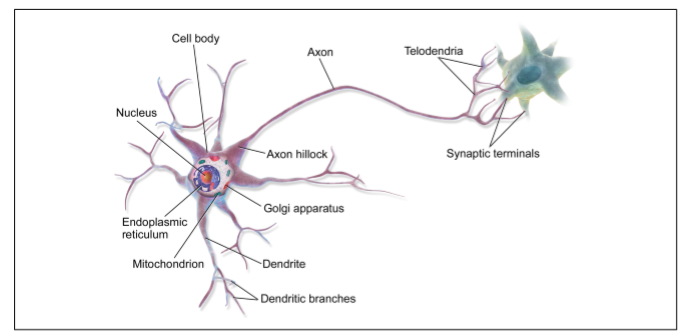
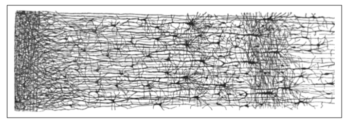
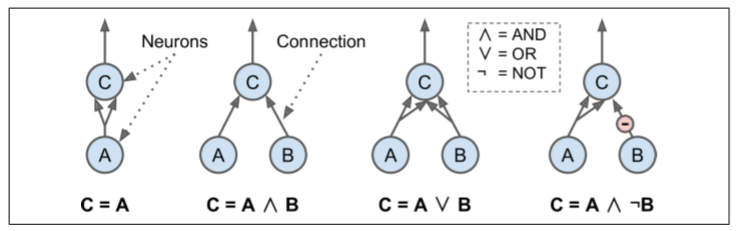
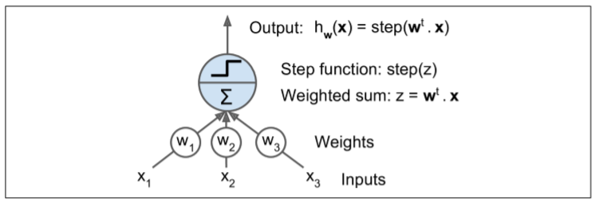
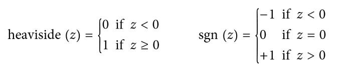
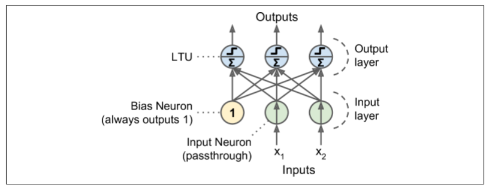
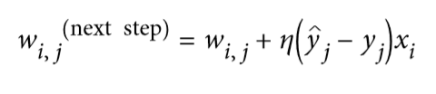
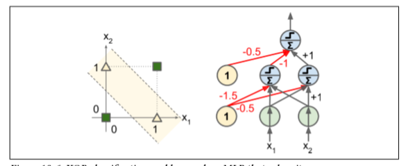

# 第10章 人工神经网络介绍

鸟类启发我们飞翔，牛蒡植物启发了尼龙绳，大自然也激发了许多其他发明。从逻辑上看，大脑是如何构建智能机器的灵感。这是启发人工神经网络（ANNs）的关键思想。然而，尽管飞机受到鸟类的启发，但它们不必拍动翅膀。同样的，ANNs逐渐变得与他们的生物表兄弟有很大的不同。一些研究者甚至争辩说，我们应该完全放弃生物类比（例如，通过说“单位”而不是“神经元”），以免我们把我们的创造力限制在生物学的系统上。

人工神经网络是深度学习的核心。它们具有通用性、强大性和可扩展性，使得它们能够很好地解决大型和高度复杂的机器学习任务，例如分类数十亿图像（例如，谷歌图像），强大的语音识别服务（例如，苹果的Siri），通过每天追踪数百万的用户的行为推荐最好的视频（比如YouTube），或者通过在游戏中击败世界冠军，通过学习数百万的游戏，然后与自己对抗（DeepMind的AlgFaGo）。

在本章中，我们将介绍人工神经网络，从快速游览的第一个ANN架构开始。然后，我们将提出多层感知器（MLP），并基于TensorFlow实现MNIST数字分类问题（在第3章中介绍）。

##从生物到人工神经元

令人惊讶的是，人工神经网络已经存在了相当长的一段时间：它们最初是由神经生理学家Warren McCulloch和数学家Walter Pitts在1943提出。McCulloch和Pitts在其里程碑式的论文中提出了“神经活动内在的逻辑演算”，提出了一个简化的计算模型，即生物神经元如何在动物大脑中协同工作，用逻辑进行复杂的计算。这是第一个人工神经网络体系结构。从那时起，正如我们将看到的，许多其他的神经元结构已经被发明，

直到20世纪60年代，安纳斯的早期成功才使人们普遍相信我们很快就会与真正的智能机器对话。当显然的这个承诺将不会被兑现（至少相当长一段时间）时，资金飞向别处，ANNs进入了一个漫长的黑暗时代。20世纪80年代初，随着新的网络体系结构的发明和更好的训练技术的发展，人们对人工神经网络的兴趣也在重新燃起。但到了20世纪90年代，强大的可替代机器学习技术的，如支持向量机（见第5章）受到大多数研究者的青睐，因为它们似乎提供了更好的结果和更强的理论基础。最后，我们现在目睹了另一股对ANNs感兴趣的浪潮。这波会像以前一样消失吗？有一些很好的理由相信，这一点是不同的，将会对我们的生活产生更深远的影响：

    现在有大量的数据可用于训练神经网络，ANN在许多非常复杂的问题上经常优于其他ML技术。

    自从90年代以来，计算能力的巨大增长使得在合理的时间内训练大型神经网络成为可能。这部分是由于穆尔定律，但也得益于游戏产业，它已经产生了数以百万计的强大的GPU显卡。

    改进了训练算法。公平地说，它们与上世纪90年代使用的略有不同，但这些相对较小的调整产生了巨大的正面影响。

    在实践中，人工神经网络的一些理论局限性是良性的。例如，许多人认为人工神经网络训练算法是注定的，因为它们很可能陷入局部最优，但事实证明，这在实践中是相当罕见的（或者如果它发生，它们也通常相当接近全局最优）。

    ANNs似乎已经进入了资金和进步的良性循环。基于ANNs的惊人产品定期成为头条新闻，吸引了越来越多的关注和资金，导致越来越多的进步，甚至更惊人的产品。

##生物神经元

在我们讨论人工神经元之前，让我们快速看一个生物神经元（如图10-1所示）。它是一种异常细胞，主要见于动物大脑皮层（例如，你的大脑），由包含细胞核和大多数细胞复杂成分的细胞体组成，许多分支扩展称为树突，加上一个非常长的延伸称为轴突。轴突的长度可能比细胞体长几倍，或长达几万倍。在它的末端附近，轴突分裂成许多称为telodendria的分支，在这些分支的顶端是微小的结构，称为突触末端（或简单的突触），它们连接到其他神经元的树突（或直接到细胞体）。生物神经元接收短的电脉冲，称为来自其他神经元的信号，通过这些突触。当神经元在几毫秒内接收到来自其他神经元的足够数量的信号时，它就发射出自己的信号。



因此，个体的生物神经元似乎以一种相当简单的方式运行，但是它们组织在一个巨大的数十亿神经元的网络中，每个神经元通常连接到数千个其他神经元。高度复杂的计算可以由相当简单的神经元的巨大网络来完成，就像一个复杂的蚁穴可以由每个蚂蚁的努力构造出来。生物神经网络（BNN）的体系结构仍然是主动研究的主题，但是大脑的某些部分已经被映射，并且似乎神经元经常组织在连续的层中，如图10-2所示。



##神经元的逻辑计算

Warren McCulloch和Pitts提出一个非常简单的生物神经元模型，这后来作为一个人工神经元成为众所周知：它有一个或更多的二进制（ON/OFF）输入和一个二进制输出。当超过一定数量的输入是激活时，人工神经元会激活其输出。McCulloch和Pitts表明，即使用这样一个简化的模型，也有可能建立一个人工神经元网络来计算任何你想要的逻辑命题。例如，让我们构建一些执行各种逻辑计算的ANN（见图10-3），假设当至少两个输入是激活的时候神经元被激活。



    左边的第一个网络仅仅是确认函数：如果神经元A被激活，那么神经元C也被激活（因为它接收来自神经元A的两个输入信号），但是如果神经元A关闭，那么神经元C也关闭。

    第二网络执行逻辑AND：神经元C只有在激活神经元A和B（单个输入信号不足以激活神经元C）时才被激活。

    第三网络执行逻辑OR：如果神经元A或神经元B被激活（或两者），神经元C被激活。

    最后，如果我们假设输入连接可以抑制神经元的活动（生物神经元是这样的情况），那么第四个网络计算一个稍微复杂的逻辑命题：如果神经元B关闭，只有当神经元A是激活的，神经元C才被激活。如果神经元A始终是激活的，那么你得到一个逻辑NOT：神经元C在神经元B关闭时是激活的，反之亦然。

您可以很容易地想象如何将这些网络组合起来计算复杂的逻辑表达式（参见本章末尾的练习）。

##感知器

感知器是最简单的人工神经网络结构之一，由Frank Rosenblatt发明于1957。它是基于一种稍微不同的人工神经元（见图10-4），称为线性阈值单元（LTU）：输入和输出现在是数字（而不是二进制开/关值），并且每个输入连接都与权重相连。LTU计算其输入的加权和（z＝W1×1+W2×2+ + +WN×n＝Wt·x），然后将阶跃函数应用于该和，并输出结果：HW（x）＝STEP（Z）＝STEP（WT·X）。



最常见的在感知器中使用的阶跃函数是Heaviside-阶跃函数（见方程10-1）。有时使用符号函数代替。



单一的LTU 可被用作简单线性二元分类。它计算输入的线性组合，如果结果超过阈值，它输出正类或者输出负类（就像一个逻辑回归分类或线性SVM）。例如，你可以使用单一的LTU基于花瓣长度和宽度去分类鸢尾花（也可添加额外的偏置特征x0＝1，就像我们在前一章所做的）。训练一个LTU意味着去寻找合适的 W0和W1值，（训练算法稍后提到）。

感知器简单地由一层LTU组成，每个神经元连接到所有输入。这些连接通常用特殊的被称为输入神经元的传递神经元来表示：它们只输出它们所输入的任何输入。此外，通常添加额外偏置特征（X0＝1）。这种偏置特性通常用一种称为偏置神经元的特殊类型的神经元来表示，它总是输出1。

图10-5表示具有两个输入和三个输出的感知器。该感知器可以将实例同时分类为三个不同的二进制类，这使得它是一个多输出分类器。



那么感知器是如何训练的呢？Frank Rosenblatt提出的感知器训练算法在很大程度上受到Hebb规则的启发。在1949出版的《行为组织》一书中，Donald Hebb提出，当一个生物神经元经常触发另一个神经元时，这两个神经元之间的联系就会变得更强。这个想法后来被 Siegrid Löwel 总结为一个吸引人的短语：“一起燃烧的细胞，汇合在一起。”这个规则后来被称为Hebb规则（或HebBIN学习）；也就是说，当两个神经元具有相同的输出时，它们之间的连接权重就会增加。使用这个规则的变体来训练感知器，该规则考虑了网络所犯的错误；它不加强导致错误输出的连接。更具体地，感知器一次被馈送一个训练实例，并且对于每个实例，它进行预测。对于每一个产生错误预测的输出神经元，它加强了输入的连接权重，这将有助于正确的预测。该规则在方程式10-2中示出。



    其中Wi，j是第i输入神经元与JTH输出神经元之间的连接权重。

    xi是当前培训实例与输入值。

    Y帽是当前训练实例的第J个输出神经元的输出。
    
    Yj是当前训练实例的第J个输出神经元的目标输出。
    
    ε是学习率。

每个输出神经元的决策边界是线性的，因此Perceptrons不能学习复杂的模式（就像Logistic回归分类器）。然而，如果训练实例是线性可分离的，Rosenblatt证明该算法将收敛到一个解。这被称为感知器收敛定理。

sklearn提供了一个感知器类，它实现了一个LTU网络。它可以像你所期望的那样使用，例如在iris数据集（第4章中介绍）：

```python
import numpy as np 
from sklearn.datasets 
import load_iris from sklearn.linear_model import Perceptron
iris = load_iris() X = iris.data[:, (2, 3)]  # 花瓣长度，宽度 
y = (iris.target == 0).astype(np.int) 
per_clf = Perceptron(random_state=42) 
per_clf.fit(X, y)
y_pred = per_clf.predict([[2, 0.5]])  
```

您可能已经认识到，感知器学习算法类似于随机梯度下降。事实上，sklearn的感知器类相当于使用具有以下超参数的SGD分类器：loss="perceptron", learning_rate="constant"（学习率）, eta0=1 ， penalty=None（无正则化）。

注意，与逻辑斯蒂回归分类器相反，感知机不输出类概率，而是基于硬阈值进行预测。这是你喜欢逻辑斯蒂回归很好的一个理由。

在他们的1969个题为“感知者”的专著中，Marvin Minsky和Seymour Papert强调了感知机的许多严重缺陷，特别是它们不能解决一些琐碎的问题（例如，异或（XOR）分类问题）；参见图10-6的左侧）。当然，其他的线性分类模型（如Logistic回归分类器）也都实现不了，但研究人员期望从感知器中得到更多，他们的失望是很大的：因此，许多研究人员放弃了联结主义（即神经网络的研究），这有利于更高层次的问题，如逻辑、问题解决和搜索。

然而，事实证明，感知器的一些局限性可以通过堆叠多个感知器来消除。由此产生的人工神经网络被称为多层感知器（MLP）。特别地，MLP可以解决XOR问题，因为你可以通过计算图10-6右侧所示的MLP的输出来验证输入的每一个组合：输入（0, 0）或（1, 1）网络输出0，并且输入（0, 1）或（1, 0）它输出1。



##多层感知器与反向传播


**使用普通TensorFlow训练DNN**

如果您想要更好地控制网络架构，您可能更喜欢使用TensorFlow的较低级别的Python API（在第9章中介绍）。 在本节中，我们将使用与之前的API相同的模型，我们将实施Minibatch 梯度下降来在MNIST数据集上进行训练。 第一步是建设阶段，构建TensorFlow图。 第二步是执行阶段，您实际运行计算图谱来训练模型。

Construction Phase

开始吧。 首先我们需要导入tensorflow库。 然后我们必须指定输入和输出的数量，并设置每个层中隐藏的神经元数量：

```
import tensorflow as tf
n_inputs = 28*28 # MNIST
n_hidden1 = 300
n_hidden2 = 100
n_outputs = 10
```

接下来，与第9章一样，您可以使用占位符节点来表示训练数据和目标。 X的形状仅有部分被定义。 我们知道它将是一个2D张量（即一个矩阵），沿着第一个维度的实例和第二个维度的特征，我们知道特征的数量将是28×28（每像素一个特征） 但是我们不知道每个训练批次将包含多少个实例。 所以X的形状是（None，n_inputs）。 同样，我们知道y将是一个1D张量，每个实例有一个入口，但是我们再次不知道在这一点上训练批次的大小，所以形状（None）。

```
X = tf.placeholder(tf.float32, shape=(None, n_inputs), name="X")
y = tf.placeholder(tf.int64, shape=(None), name="y")
```

现在让我们创建一个实际的神经网络。 占位符X将作为输入层; 在执行阶段，它将一次更换一个训练批次（注意训练批中的所有实例将由神经网络同时处理）。 现在您需要创建两个隐藏层和输出层。 两个隐藏的层几乎相同：它们只是它们所连接的输入和它们包含的神经元的数量不同。 输出层也非常相似，但它使用softmax激活功能而不是ReLU激活功能。 所以让我们创建一个neuron_layer() 函数，我们将一次创建一个图层。 它将需要参数来指定输入，神经元数量，激活功能和图层的名称：

```
def neuron_layer(X, n_neurons, name, activation=None):
    with tf.name_scope(name):
        n_inputs = int(X.get_shape()[1])
        stddev = 2 / np.sqrt(n_inputs)
        init = tf.truncated_normal((n_inputs, n_neurons), stddev=stddev)
        W = tf.Variable(init, name="weights")
        b = tf.Variable(tf.zeros([n_neurons]), name="biases")
        z = tf.matmul(X, W) + b
        if activation == "relu":
            return tf.nn.relu(z)
        else:
            return z
```

我们逐行浏览这个代码：

1.首先，我们使用名称范围来创建每层的名称：它将包含该神经元层的所有计算节点。 这是可选的，但如果节点组织良好，则TensorBoard图形将会更加出色。

2.接下来，我们通过查找输入矩阵的形状并获得第二个维度的大小来获得输入数量（第一个维度用于实例）。

3\. 接下来的三行创建一个保存权重矩阵的W变量。 它将是包含每个输入和每个神经元之间的所有连接权重的2D张量;因此，它的形状将是（n_inputs，n_neurons）。它将被随机初始化，使用具有标准差为的截断的正态（高斯）分布(使用截断的正态分布而不是常规正态分布确保不会有任何大的权重，这可能会减慢培训。).使用这个特定的标准差有助于算法的收敛速度更快（我们将在第11章中进一步讨论这一点），这是对神经网络的微小调整之一，对它们的效率产生了巨大的影响）。 重要的是为所有隐藏层随机初始化连接权重，以避免梯度下降算法无法中断的任何对称性。

例如，如果将所有权重设置为0，则所有神经元将输出0，并且给定隐藏层中的所有神经元的误差梯度将相同。 然后，梯度下降步骤将在每个层中以相同的方式更新所有权重，因此它们将保持相等。 换句话说，尽管每层有数百个神经元，你的模型就像每层只有一个神经元一样。

4\. 下一行创建一个偏差的b变量，初始化为0（在这种情况下无对称问题），每个神经元有一个偏置参数。

5\. 然后我们创建一个子图来计算z = X·W + b。 该向量化实现将有效地计算输入的加权和加上层中每个神经元的偏置，对于批次中的所有实例，仅需一次.

6.最后，如果激活参数设置为“relu”，则代码返回relu（z）（即max（0，z）），否则它只返回z。

好了，现在你有一个很好的函数来创建一个神经元层。 让我们用它来创建深层神经网络！ 第一个隐藏层以X为输入。 第二个将第一个隐藏层的输出作为其输入。 最后，输出层将第二个隐藏层的输出作为其输入。

```
    with tf.name_scope("dnn"):
        hidden1 = neuron_layer(X, n_hidden1, "hidden1", activation="relu")
    hidden2 = neuron_layer(hidden1, n_hidden2, "hidden2", activation="relu")
    logits = neuron_layer(hidden2, n_outputs, "outputs")

```

请注意，为了清楚起见，我们再次使用名称范围。 还要注意，logit是在通过softmax激活函数之前神经网络的输出：为了优化，我们稍后将处理softmax计算。

正如你所期望的，TensorFlow有许多方便的功能来创建标准的神经网络层，所以通常不需要像我们刚才那样定义你自己的neuron_layer（）函数。 例如，TensorFlow的fully_connected（）函数创建一个完全连接的层，其中所有输入都连接到图层中的所有神经元。 它使用正确的初始化策略来负责创建权重和偏置变量，并且默认情况下使用ReLU激活功能（我们可以使用activate_fn参数来更改它）。 正如我们将在第11章中看到的，它还支持正则化和归一化参数。 我们来调整上面的代码来使用fully_connected（）函数，而不是我们的neuron_layer（）函数。 只需导入该功能，并使用以下代码替换dnn构建部分：

```
    from tensorflow.contrib.layers import fully_connected
    with tf.name_scope("dnn"):
        hidden1 = fully_connected(X, n_hidden1, scope="hidden1")
        hidden2 = fully_connected(hidden1, n_hidden2, scope="hidden2")
        logits = fully_connected(hidden2, n_outputs, scope="outputs",
                                    activation_fn=None)
```

tensorflow.contrib包包含许多有用的功能，但它是一个尚未分级成为主要TensorFlow API一部分的实验代码的地方。 因此，full_connected（）函数（和任何其他contrib代码）可能会在将来更改或移动。

使用dense（）代替neuron_layer（）

注意：本书使用tensorflow.contrib.layers.fully_connected（）而不是tf.layers.dense（）（本章编写时不存在）。

现在最好使用tf.layers.dense（），因为contrib模块中的任何内容可能会更改或删除，恕不另行通知。 dense（）函数与fully_connected（）函数几乎相同，除了一些细微的差别：

几个参数被重命名：scope变为名称，activation_fn变为激活（同样_fn后缀从其他参数（如normalizer_fn）中删除），weights_initializer成为kernel_initializer等。默认激活现在是无，而不是tf.nn.relu。 第11章还介绍了更多的差异。

```
with tf.name_scope("dnn"):
    hidden1 = tf.layers.dense(X, n_hidden1, name="hidden1",
                              activation=tf.nn.relu)
    hidden2 = tf.layers.dense(hidden1, n_hidden2, name="hidden2",
                              activation=tf.nn.relu)
    logits = tf.layers.dense(hidden2, n_outputs, name="outputs")
```

现在我们已经有了神经网络模型，我们需要定义我们用来训练的损失函数。 正如我们在第4章中对Softmax回归所做的那样，我们将使用交叉熵。 正如我们之前讨论的，交叉熵将惩罚估计目标类的概率较低的模型。 TensorFlow提供了几种计算交叉熵的功能。 我们将使用sparse_softmax_cross_entropy_with_logits（）：它根据“logit”计算交叉熵（即，在通过softmax激活函数之前的网络输出），并且期望以0到-1数量的整数形式的标签（在我们的例子中，从0到9）。 这将给我们一个包含每个实例的交叉熵的1D张量。 然后，我们可以使用TensorFlow的reduce_mean（）函数来计算所有实例的平均交叉熵。

```
with tf.name_scope("loss"):
    xentropy = tf.nn.sparse_softmax_cross_entropy_with_logits(labels=y, logits=logits)
    loss = tf.reduce_mean(xentropy, name="loss")
```

该sparse_softmax_cross_entropy_with_logits（）函数等同于应用SOFTMAX激活功能，然后计算交叉熵，但它更高效，它妥善照顾的角落情况下，比如logits等于0,这就是为什么我们没有较早的应用SOFTMAX激活函数。 还有称为softmax_cross_entropy_with_logits（）的另一个函数，该函数在标签one-hot载体的形式（而不是整数0至类的数目减1）。

我们有神经网络模型，我们有成本函数，现在我们需要定义一个GradientDescentOptimizer来调整模型参数以最小化损失函数。 没什么新鲜的; 就像我们在第9章中所做的那样：

```
learning_rate = 0.01

with tf.name_scope("train"):
    optimizer = tf.train.GradientDescentOptimizer(learning_rate)
    training_op = optimizer.minimize(loss)
```

建模阶段的最后一个重要步骤是指定如何评估模型。 我们将简单地将精度用作我们的绩效指标。 首先，对于每个实例，通过检查最高logit是否对应于目标类别来确定神经网络的预测是否正确。 为此，您可以使用in_top_k（）函数。 这返回一个充满布尔值的1D张量，因此我们需要将这些布尔值转换为浮点数，然后计算平均值。 这将给我们网络的整体准确性.

```
with tf.name_scope("eval"):
    correct = tf.nn.in_top_k(logits, y, 1)
    accuracy = tf.reduce_mean(tf.cast(correct, tf.float32))
```

而且，像往常一样，我们需要创建一个初始化所有变量的节点，我们还将创建一个Saver来将我们训练有素的模型参数保存到磁盘中：

```
init = tf.global_variables_initializer()
saver = tf.train.Saver()
```

唷！ 建模阶段结束。 这是不到40行代码，但相当激烈：我们为输入和目标创建占位符，我们创建了一个构建神经元层的函数，我们用它来创建DNN，我们定义了成本函数，我们 创建了一个优化器，最后定义了性能指标。 现在到执行阶段。

Execution Phase

这部分要短得多，更简单。 首先，我们加载MNIST。 我们可以像之前的章节那样使用ScikitLearn，但是TensorFlow提供了自己的帮助器来获取数据，将其缩放（0到1之间），将它洗牌，并提供一个简单的功能来一次加载一个小批量：

```
from tensorflow.examples.tutorials.mnist import input_data

mnist = input_data.read_data_sets("/tmp/data/")
```

现在我们定义我们要运行的迭代数，以及小批量的大小：

```
n_epochs = 10001
batch_size = 50
```

现在我们去训练模型:

```
with tf.Session() as sess:
    init.run()
    for epoch in range(n_epochs):
        for iteration in range(mnist.train.num_examples // batch_size):
            X_batch, y_batch = mnist.train.next_batch(batch_size)
            sess.run(training_op, feed_dict={X: X_batch, y: y_batch})
        acc_train = accuracy.eval(feed_dict={X: X_batch, y: y_batch})
        acc_test = accuracy.eval(feed_dict={X: mnist.test.images, y: mnist.test.labels})
        print(epoch, "Train accuracy:", acc_train, "Test accuracy:", acc_test)

    save_path = saver.save(sess, "./my_model_final.ckpt")
```

该代码打开一个TensorFlow会话，并运行初始化所有变量的init节点。 然后它运行的主要训练循环：在每个时期，通过一些小批次的对应于训练集的大小的代码进行迭代。 每个小批量通过next_batch（）方法获取，然后代码简单地运行训练操作，为当前的小批量输入数据和目标提供。 接下来，在每个时期结束时，代码评估最后一个小批量和完整训练集上的模型，并打印出结果。 最后，模型参数保存到磁盘。

Using the Neural Network

现在神经网络被训练了，你可以用它进行预测。 为此，您可以重复使用相同的建模阶段，但是更改执行阶段，如下所示：

```
with tf.Session() as sess:
    saver.restore(sess, "./my_model_final.ckpt") # or better, use save_path
    X_new_scaled = mnist.test.images[:20]
    Z = logits.eval(feed_dict={X: X_new_scaled})
    y_pred = np.argmax(Z, axis=1)
```

首先，代码从磁盘加载模型参数。 然后加载一些您想要分类的新图像。 记住应用与训练数据相同的特征缩放（在这种情况下，将其从0缩放到1）。 然后代码评估对数点节点。 如果您想知道所有估计的类概率，则需要将softmax（）函数应用于对数，但如果您只想预测一个类，则可以简单地选择具有最高logit值的类（使用 argmax（）函数做的伎俩）。

Fine-Tuning Neural Network Hyperparameters

神经网络的灵活性也是其主要缺点之一：有很多超参数要进行调整。 不仅可以使用任何可想象的网络拓扑（如何神经元互连），而且即使在简单的MLP中，您可以更改层数，每层神经元数，每层使用的激活函数类型，weights 初始化逻辑等等。 你怎么知道什么组合的超参数是最适合你的任务？

当然，您可以使用具有交叉验证的网格搜索来查找正确的超参数，就像您在前几章中所做的那样，但是由于要调整许多超参数，并且由于在大型数据集上训练神经网络需要很多时间， 您只能在合理的时间内探索超参数空间的一小部分。 正如我们在第2章中讨论的那样，使用随机搜索 [http://http://www.jmlr.org/papers/volume13/bergstra12a/bergstra12a.pdf](http://http//www.jmlr.org/papers/volume13/bergstra12a/bergstra12a.pdf) 要好得多。另一个选择是使用诸如Oscar之类的工具，它可以实现更复杂的算法，以帮助您快速找到一组好的超参数.

它有助于了解每个超级参数的值是合理的，因此您可以限制搜索空间。 我们从隐藏层数开始。

Number of Hidden Layers

对于许多问题，您只需从单个隐藏层开始，您将获得合理的结果。 实际上已经表明，只有一个隐藏层的MLP可以建模甚至最复杂的功能，只要它具有足够的神经元。 长期以来，这些事实说服了研究人员，没有必要调查任何更深层次的神经网络。 但是他们忽略了这样一个事实：深层网络具有比浅层网络更高的参数效率：他们可以使用比浅网格更少的神经元来建模复杂的函数，使得训练更快。

要了解为什么，假设您被要求使用一些绘图软件绘制一个森林，但是您被禁止使用复制/粘贴。 你必须单独绘制每棵树，每枝分枝，每叶叶。 如果你可以画一个叶，复制/粘贴它来绘制一个分支，然后复制/粘贴该分支来创建一个树，最后复制/粘贴这个树来制作一个林，你将很快完成。 现实世界的数据通常以这样一种分层的方式进行结构化，DNN自动利用这一事实：较低的隐藏层模拟低级结构（例如，各种形状和方向的线段），中间隐藏层将这些低级结构组合到 模型中级结构（例如，正方形，圆形）和最高隐藏层和输出层将这些中间结构组合在一起，以模拟高级结构（如面）。

这种分层架构不仅可以帮助DNN更快地融合到一个很好的解决方案，而且还可以提高其将其推广到新数据集的能力。 例如，如果您已经训练了模型以识别图片中的脸部，并且您现在想要训练一个新的神经网络来识别发型，那么您可以通过重新使用第一个网络的较低层次来启动训练。 而不是随机初始化新神经网络的前几层的权重和偏置，您可以将其初始化为第一个网络的较低层的权重和偏置的值。这样，网络将不必从大多数图片中低结构中从头学习; 它只需要学习更高层次的结构（例如发型）。

总而言之，对于许多问题，您可以从一个或两个隐藏层开始，它可以正常工作（例如，您可以使用只有一个隐藏层和几百个神经元，在MNIST数据集上容易达到97％以上的准确度使用两个具有相同总神经元数量的隐藏层，在大致相同的训练时间量中精确度为98％）。对于更复杂的问题，您可以逐渐增加隐藏层的数量，直到您开始覆盖训练集。非常复杂的任务，例如大型图像分类或语音识别，通常需要具有数十个层（或甚至数百个但不完全相连的网络）的网络，正如我们将在第13章中看到的那样），并且需要大量的训练数据。但是，您将很少从头开始训练这样的网络：重用预先训练的最先进的网络执行类似任务的部分更为常见。训练将会更快，需要更少的数据（我们将在第11章中进行讨论）

Number of Neurons per Hidden Layer

显然，输入和输出层中神经元的数量由您的任务需要的输入和输出类型决定。例如，MNIST任务需要28×28 = 784个输入神经元和10个输出神经元。对于隐藏的层次来说，通常的做法是将其设置为形成一个漏斗，每个层面上的神经元越来越少，原因在于许多低级别功能可以合并成更少的高级功能。例如，MNIST的典型神经网络可能具有两个隐藏层，第一个具有300个神经元，第二个具有100个。但是，这种做法现在并不常见，您可以为所有隐藏层使用相同的大小 - 例如，所有隐藏的层与150个神经元：这样只用调整一次超参数而不是每层都需要调整(因为如果每层一样,比如150,之后调就每层都调成160)。就像层数一样，您可以尝试逐渐增加神经元的数量，直到网络开始过度拟合。一般来说，通过增加每层的神经元数量，可以增加层数，从而获得更多的消耗。不幸的是，正如你所看到的，找到完美的神经元数量仍然是黑色的艺术.

一个更简单的方法是选择一个具有比实际需要的更多层次和神经元的模型，然后使用early stopping 来防止它过度拟合（以及其他正则化技术，特别是drop out，我们将在第11章中看到）。 这被称为“拉伸裤”的方法：而不是浪费时间寻找完美匹配您的大小的裤子，只需使用大型伸缩裤，缩小到合适的尺寸。

Activation Functions

在大多数情况下，您可以在隐藏层中使用ReLU激活功能（或其中一个变体，我们将在第11章中看到）。 与其他激活功能相比，计算速度要快一些，而梯度下降在局部最高点上并不会被卡住，因为它不会对大的输入值饱和（与逻辑函数或双曲正切函数相反, 他们容易在1饱和)

对于输出层，softmax激活函数通常是分类任务的良好选择（当这些类是互斥的时）。 对于回归任务，您完全可以不使用激活函数。

这就是人造神经网络的这个介绍。 在接下来的章节中，我们将讨论训练非常深的网络的技术，并分发多个服务器和GPU的培训。 然后我们将探讨一些其他流行的神经网络架构：卷积神经网络，复发神经网络和自动编码器。

完整代码

```
from tensorflow.examples.tutorials.mnist import input_data
import tensorflow as tf
from sklearn.metrics import accuracy_score
import numpy as np

if __name__ == '__main__':
    n_inputs = 28 * 28
    n_hidden1 = 300
    n_hidden2 = 100
    n_outputs = 10

    mnist = input_data.read_data_sets("/tmp/data/")

    X_train = mnist.train.images
    X_test = mnist.test.images
    y_train = mnist.train.labels.astype("int")
    y_test = mnist.test.labels.astype("int")

    X = tf.placeholder(tf.float32, shape= (None, n_inputs), name='X')
    y = tf.placeholder(tf.int64, shape=(None), name = 'y')

    with tf.name_scope('dnn'):
        hidden1 = tf.layers.dense(X, n_hidden1, activation=tf.nn.relu
                                  ,name= 'hidden1')

        hidden2 = tf.layers.dense(hidden1, n_hidden2, name='hidden2',
                                  activation= tf.nn.relu)

        logits = tf.layers.dense(hidden2, n_outputs, name='outputs')

    with tf.name_scope('loss'):
        xentropy = tf.nn.sparse_softmax_cross_entropy_with_logits(labels = y,
                                                                  logits = logits)
        loss = tf.reduce_mean(xentropy, name='loss')#所有值求平均

    learning_rate = 0.01

    with tf.name_scope('train'):
        optimizer = tf.train.GradientDescentOptimizer(learning_rate)
        training_op = optimizer.minimize(loss)

    with tf.name_scope('eval'):
        correct = tf.nn.in_top_k(logits ,y ,1)#是否与真值一致 返回布尔值
        accuracy = tf.reduce_mean(tf.cast(correct, tf.float32)) #tf.cast将数据转化为0,1序列

    init = tf.global_variables_initializer()

    n_epochs = 20
    batch_size = 50
    with tf.Session() as sess:
        init.run()
        for epoch in range(n_epochs):
            for iteration in range(mnist.train.num_examples // batch_size):
                X_batch, y_batch = mnist.train.next_batch(batch_size)
                sess.run(training_op,feed_dict={X:X_batch,
                                                y: y_batch})
            acc_train = accuracy.eval(feed_dict={X:X_batch,
                                                y: y_batch})
            acc_test = accuracy.eval(feed_dict={X: mnist.test.images,
                                                y: mnist.test.labels})
            print(epoch, "Train accuracy:", acc_train, "Test accuracy:", acc_test)
```
