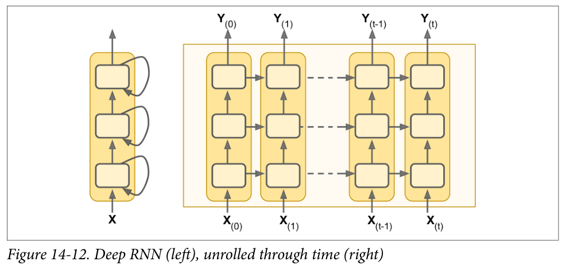
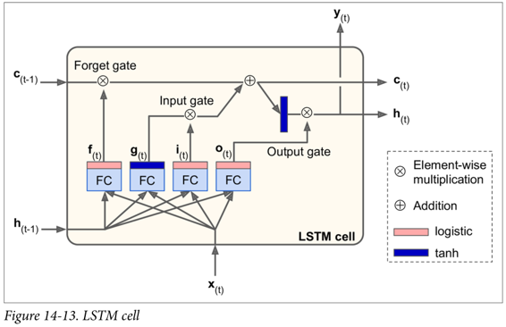
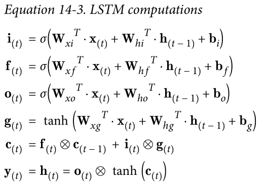
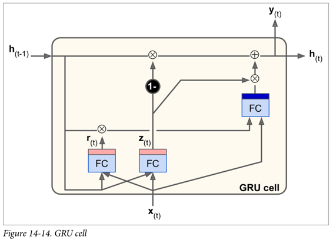
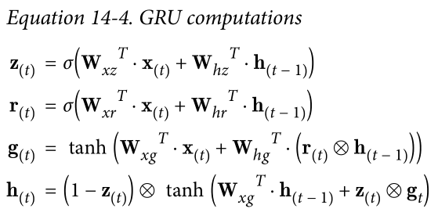

# 第14章 循环神经网络

击球手击出垒球，你会开始预测球的轨迹并立即开始奔跑。你追踪着它，不断调整你的移动步伐，最终在观众的一片雷鸣声中抓到它。无论是在听完朋友的话语还是早餐时预测咖啡的味道，你时刻在做的事就是在预测未来。在本章中，我们将讨论循环神经网络 -- 一类预测未来的网络（当然，是到目前为止）。它们可以分析时间序列数据，诸如股票价格，并告诉你什么时候买入和卖出。在自动驾驶系统中，他们可以预测行车轨迹，避免发生交通意外。更一般地说，它们可在任意长度的序列上工作，而不是截止目前我们讨论的只能在固定长度的输入上工作的网络。举个例子，它们可以把语句，文件，以及语音范本作为输入，使得它们在诸如自动翻译，语音到文本或者情感分析（例如，读取电影评论并提取评论者关于该电影的感觉）的自然语言处理系统中极为有用。

更近一步，循环神经网络的预测能力使得它们具备令人惊讶的创造力。你同样可以要求它们去预测一段旋律的下几个音符，然后随机选取这些音符的其中之一并演奏它。然后要求网络给出接下来最可能的音符，演奏它，如此周而复始。在你知道它之前，你的神经网络将创作一首诸如由谷歌 Magenta 工程所创造的《The one》的歌曲。类似的，循环神经网络可以生成语句，图像标注以及更多。目前结果还不能准确得到莎士比亚或者莫扎特的作品，但谁知道几年后他们能生成什么呢？

在本章中，我们将看到循环神经网络背后的基本概念，他们所面临的主要问题（换句话说，在第11章中讨论的消失／爆炸的梯度），以及广泛用于反抗这些问题的方法：LSTM 和 GRU cell（单元）。如同以往，沿着这个方式，我们将展示如何用 TensorFlow 实现循环神经网络。最终我们将看看及其翻译系统的架构。

## 循环神经元

到目前为止，我们主要关注的是前馈神经网络，其中激活仅从输入层到输出层的一个方向流动（附录E中的几个网络除外）。 循环神经网络看起来非常像一个前馈神经网络，除了它也有连接指向后方。 让我们看一下最简单的 RNN，它由一个神经元接收输入，产生一个输出，并将输出发送回自己，如图 14-1（左）所示。 在每个时间步`t`（也称为一个帧），这个循环神经元接收输入 $x^{(t)}$ 以及它自己的前一时间步长 $y^{(t-1)}$ 的输出。 我们可以用时间轴来表示这个微小的网络，如图 14-1（右）所示。 这被称为随着时间的推移展开网络。


您可以轻松创建一个循环神经元层。 在每个时间步t，每个神经元都接收输入向量 $x^{(t)}$ 和前一个时间步 $y^{(t-1)}$ 的输出向量，如图 14-2 所示。 请注意，输入和输出都是向量（当只有一个神经元时，输出是一个标量）。


每个循环神经元有两组权重：一组用于输入 $x^{(t)}$，另一组用于前一时间步长 $y^{(t-1)}$ 的输出。 我们称这些权重向量为 $w_x$ 和 $w_y$。如公式 14-1 所示（`b`是偏差项，`φ(·)`是激活函数，例如 ReLU），可以计算单个循环神经元的输出。


就像前馈神经网络一样，我们可以使用上一个公式的向量化形式，对整个小批量计算整个层的输出（见公式 14-2）。


*   $Y^{(t)} 是 $m \times n_{neurons}$ 矩阵，包含在最小批次中每个实例在时间步`t`处的层输出（`m`是小批次中的实例数，$n_{neurons}$ 是神经元数）。
*   $X^(t)$ 是 $m \times n_{inputs}$ 矩阵，包含所有实例的输入的 （$n_{inputs}$ 是输入特征的数量）。
*   $W_x$ 是 $n_{inputs} \times n_{neurons}$ 矩阵，包含当前时间步的输入的连接权重的。
*   $W_y$ 是 $n_{neurons} \times n_{neurons}$ 矩阵，包含上一个时间步的输出的连接权重。
*   权重矩阵 $W_x$ 和 $W_y$ 通常连接成单个权重矩阵`W`，形状为 $(n_{inputs}+n_{neurons}) \times n_{neurons}$（见公式 14-2 的第二行）
*   `b`是大小为 $n_{neurons}$ 的向量，包含每个神经元的偏置项。

注意，$Y^{(t)}$ 是 $X^{(t)}$ 和 $Y^{(t-1)}$ 的函数，它是 $X^{(t-1)}$ 和 $Y^{(t-2)}$ 的函数，它是 $X^{(t-2)}$ 和 $Y^{(t-3)}$ 的函数，等等。 这使得 $Y^{(t)}$ 是从时间`t = 0`开始的所有输入（即 $X^{(0)}$，$X^{(1)}$，...，$X^{(t)}$）的函数。 在第一个时间步，`t = 0`，没有以前的输出，所以它们通常被假定为全零。

## 记忆单元

由于时间`t`的循环神经元的输出，是由所有先前时间步骤计算出来的的函数，你可以说它有一种记忆形式。一个神经网络的一部分，跨越时间步长保留一些状态，称为存储单元（或简称为单元）。单个循环神经元或循环神经元层是非常基本的单元，但本章后面我们将介绍一些更为复杂和强大的单元类型。

一般情况下，时间步`t`处的单元状态，记为 $h^{(t)}$（`h`代表“隐藏”），是该时间步的某些输入和前一时间步的状态的函数：$h^{(t)} = f(h^{(t-1), x^{(t)})$。 其在时间步`t`处的输出，表示为 $y^{(t)}$，也和前一状态和当前输入的函数有关。 在我们已经讨论过的基本单元的情况下，输出等于单元状态，但是在更复杂的单元中并不总是如此，如图 14-3 所示。


## 输入和输出序列


RNN 可以同时进行一系列输入并产生一系列输出（见图 14-4，左上角的网络）。 例如，这种类型的网络对于预测时间序列（如股票价格）非常有用：您在过去的`N`天内给出价格，并且它必须输出向未来一天移动的价格（即从`N - 1`天前到明天）。

或者，您可以向网络输入一系列输入，并忽略除最后一个之外的所有输出（请参阅右上角的网络）。 换句话说，这是一个向量网络的序列。 例如，您可以向网络提供与电影评论相对应的单词序列，并且网络将输出情感评分（例如，从`-1 [恨]`到`+1 [爱]`）。

相反，您可以在第一个时间步中为网络提供一个输入（而在其他所有时间步中为零），然后让它输出一个序列（请参阅左下角的网络）。 这是一个向量到序列的网络。 例如，输入可以是图像，输出可以是该图像的标题。

最后，你可以有一个序列到向量网络，称为编码器，后面跟着一个称为解码器的向量到序列网络（参见右下角的网络）。 例如，这可以用于将句子从一种语言翻译成另一种语言。 你会用一种语言给网络喂一个句子，编码器会把这个句子转换成单一的向量表示，然后解码器将这个向量解码成另一种语言的句子。 这种称为编码器 - 解码器的两步模型，比用单个序列到序列的 RNN（如左上方所示的那个）快速地进行翻译要好得多，因为句子的最后一个单词可以 影响翻译的第一句话，所以你需要等到听完整个句子才能翻译。

## TensorFlow 中的基本 RNN

首先，我们来实现一个非常简单的 RNN 模型，而不使用任何 TensorFlow 的 RNN 操作，以更好地理解发生了什么。 我们将使用 tanh 激活函数创建由 5 个循环神经元的循环层组成的 RNN（如图 14-2 所示的 RNN）。 我们将假设 RNN 只运行两个时间步，每个时间步输入大小为 3 的向量。 下面的代码构建了这个 RNN，展开了两个时间步骤：

```
n_inputs = 3
n_neurons = 5
X0 = tf.placeholder(tf.float32, [None, n_inputs])
X1 = tf.placeholder(tf.float32, [None, n_inputs])
Wx = tf.Variable(tf.random_normal(shape=[n_inputs, n_neurons], dtype=tf.float32))
Wy = tf.Variable(tf.random_normal(shape=[n_neurons, n_neurons], dtype=tf.float32))
b = tf.Variable(tf.zeros([1, n_neurons], dtype=tf.float32))
Y0 = tf.tanh(tf.matmul(X0, Wx) + b)
Y1 = tf.tanh(tf.matmul(Y0, Wy) + tf.matmul(X1, Wx) + b)
init = tf.global_variables_initializer()
```

这个网络看起来很像一个双层前馈神经网络，有一些改动：首先，两个层共享相同的权重和偏差项，其次，我们在每一层都有输入，并从每个层获得输出。 为了运行模型，我们需要在两个时间步中都有输入，如下所示：

```
    # Mini-batch: instance 0,instance 1,instance 2,instance 3
    X0_batch = np.array([[0, 1, 2], [3, 4, 5], [6, 7, 8], [9, 0, 1]])  # t = 0
    X1_batch = np.array([[9, 8, 7], [0, 0, 0], [6, 5, 4], [3, 2, 1]])  # t = 1
    with tf.Session() as sess:
        init.run()
    Y0_val, Y1_val = sess.run([Y0, Y1], feed_dict={X0: X0_batch, X1: X1_batch})
```

这个小批量包含四个实例，每个实例都有一个由两个输入组成的输入序列。 最后，`Y0_val`和`Y1_val`在所有神经元和小批量中的所有实例的两个时间步中包含网络的输出：

```
>>> print(Y0_val) # output at t = 0
[[-0.2964572 0.82874775 -0.34216955 -0.75720584 0.19011548] # instance 0
[-0.12842922 0.99981797 0.84704727 -0.99570125 0.38665548] # instance 1
[ 0.04731077 0.99999976 0.99330056 -0.999933 0.55339795] # instance 2
[ 0.70323634 0.99309105 0.99909431 -0.85363263 0.7472108 ]] # instance 3
>>> print(Y1_val) # output at t = 1
[[ 0.51955646 1\. 0.99999022 -0.99984968 -0.24616946] # instance 0
[-0.70553327 -0.11918639 0.48885304 0.08917919 -0.26579669] # instance 1
[-0.32477224 0.99996376 0.99933046 -0.99711186 0.10981458] # instance 2
[-0.43738723 0.91517633 0.97817528 -0.91763324 0.11047263]] # instance 3
```

这并不难，但是当然如果你想能够运行 100 多个时间步骤的 RNN，这个图形将会非常大。 现在让我们看看如何使用 TensorFlow 的 RNN 操作创建相同的模型。

完整代码

```
import numpy as np
import tensorflow as tf

if __name__ == '__main__':
    n_inputs = 3
    n_neurons = 5
    X0 = tf.placeholder(tf.float32, [None, n_inputs])
    X1 = tf.placeholder(tf.float32, [None, n_inputs])
    Wx = tf.Variable(tf.random_normal(shape=[n_inputs, n_neurons], dtype=tf.float32))
    Wy = tf.Variable(tf.random_normal(shape=[n_neurons, n_neurons], dtype=tf.float32))
    b = tf.Variable(tf.zeros([1, n_neurons], dtype=tf.float32))
    Y0 = tf.tanh(tf.matmul(X0, Wx) + b)
    Y1 = tf.tanh(tf.matmul(Y0, Wy) + tf.matmul(X1, Wx) + b)
    init = tf.global_variables_initializer()

    # Mini-batch: instance 0,instance 1,instance 2,instance 3
    X0_batch = np.array([[0, 1, 2], [3, 4, 5], [6, 7, 8], [9, 0, 1]])  # t = 0
    X1_batch = np.array([[9, 8, 7], [0, 0, 0], [6, 5, 4], [3, 2, 1]])  # t = 1
    with tf.Session() as sess:
        init.run()
        Y0_val, Y1_val = sess.run([Y0, Y1], feed_dict={X0: X0_batch, X1: X1_batch})

    print(Y0_val,'\n')
    print(Y1_val)
```

## 时间上的静态展开

`static_rnn()`函数通过链接单元来创建一个展开的 RNN 网络。 下面的代码创建了与上一个完全相同的模型：

```
X0 = tf.placeholder(tf.float32, [None, n_inputs])
X1 = tf.placeholder(tf.float32, [None, n_inputs])

basic_cell = tf.contrib.rnn.BasicRNNCell(num_units=n_neurons)
output_seqs, states = tf.contrib.rnn.static_rnn(basic_cell, [X0, X1],
                                                dtype=tf.float32)
Y0, Y1 = output_seqs
```

首先，我们像以前一样创建输入占位符。 然后，我们创建一个`BasicRNNCell`，您可以将其视为一个工厂，创建单元的副本以构建展开的 RNN（每个时间步一个）。 然后我们调用`static_rnn()`，向它提供单元工厂和输入张量，并告诉它输入的数据类型（用来创建初始状态矩阵，默认情况下是全零）。 `static_rnn()`函数为每个输入调用单元工厂的`__call __()`函数，创建单元的两个副本（每个单元包含 5 个循环神经元的循环层），并具有共享的权重和偏置项，像前面一样。`static_rnn()`函数返回两个对象。 第一个是包含每个时间步的输出张量的 Python 列表。 第二个是包含网络最终状态的张量。 当你使用基本的单元时，最后的状态就等于最后的输出。

如果有 50 个时间步长，则不得不定义 50 个输入占位符和 50 个输出张量。而且，在执行时，您将不得不为 50 个占位符中的每个占位符输入数据并且还要操纵 50 个输出。我们来简化一下。下面的代码再次构建相同的 RNN，但是这次它需要一个形状为`[None，n_steps，n_inputs]`的单个输入占位符，其中第一个维度是最小批量大小。然后提取每个时间步的输入序列列表。 `X_seqs`是形状为`n_steps`的 Python 列表，包含形状为`[None，n_inputs]`的张量，其中第一个维度同样是最小批量大小。为此，我们首先使用`transpose()`函数交换前两个维度，以便时间步骤现在是第一维度。然后，我们使 `unstack()`函数沿第一维（即每个时间步的一个张量）提取张量的 Python 列表。接下来的两行和以前一样。最后，我们使用`stack()`函数将所有输出张量合并成一个张量，然后我们交换前两个维度得到最终输出张量，形状为`[None, n_steps，n_neurons]`（第一个维度是小批量大小）。


```
X = tf.placeholder(tf.float32, [None, n_steps, n_inputs])
X_seqs = tf.unstack(tf.transpose(X, perm=[1, 0, 2]))

basic_cell = tf.contrib.rnn.BasicRNNCell(num_units=n_neurons)
output_seqs, states = tf.contrib.rnn.static_rnn(basic_cell, X_seqs,
                                                dtype=tf.float32)
outputs = tf.transpose(tf.stack(output_seqs), perm=[1, 0, 2])
```

现在我们可以通过给它提供一个包含所有小批量序列的张量来运行网络：

```
X_batch = np.array([
        # t = 0      t = 1 
        [[0, 1, 2], [9, 8, 7]], # instance 1
        [[3, 4, 5], [0, 0, 0]], # instance 2
        [[6, 7, 8], [6, 5, 4]], # instance 3
        [[9, 0, 1], [3, 2, 1]], # instance 4
    ])

with tf.Session() as sess:
    init.run()
    outputs_val = outputs.eval(feed_dict={X: X_batch})
```

我们得到所有实例，所有时间步长和所有神经元的单一`outputs_val`张量：


但是，这种方法仍然会建立一个每个时间步包含一个单元的图。 如果有 50 个时间步，这个图看起来会非常难看。 这有点像写一个程序而没有使用循环（例如，`Y0 = f(0,X0)`；`Y1 = f(Y0,X1)`；`Y2 = f(Y1,X2)`；...；`Y50 = f(Y49,X50)`）。 如果使用大图，在反向传播期间（特别是在 GPU 内存有限的情况下），您甚至可能会发生内存不足（OOM）错误，因为它必须在正向传递期间存储所有张量值，以便可以使用它们在反向传播期间计算梯度。

幸运的是，有一个更好的解决方案：`dynamic_rnn()`函数。

## 时间上的动态展开

`dynamic_rnn()`函数使用`while_loop()`操作，在单元上运行适当的次数，如果要在反向传播期间将 GPU内 存交换到 CPU 内存，可以设置`swap_memory = True`，以避免内存不足错误。 方便的是，它还可以在每个时间步（形状为`[None, n_steps, n_inputs]`）接受所有输入的单个张量，并且在每个时间步（形状`[None, n_steps, n_neurons]`）上输出所有输出的单个张量。 没有必要堆叠，拆散或转置。 以下代码使用`dynamic_rnn()`函数创建与之前相同的 RNN。 这太好了！

完整代码

```
import numpy as np
import tensorflow as tf
import pandas as pd

if __name__ == '__main__':
    n_steps = 2
    n_inputs = 3
    n_neurons = 5

    X = tf.placeholder(tf.float32, [None, n_steps, n_inputs])

    basic_cell = tf.contrib.rnn.BasicRNNCell(num_units=n_neurons)
    outputs, states = tf.nn.dynamic_rnn(basic_cell, X, dtype=tf.float32)

    init = tf.global_variables_initializer()

    X_batch = np.array([
        [[0, 1, 2], [9, 8, 7]],  # instance 1
        [[3, 4, 5], [0, 0, 0]],  # instance 2
        [[6, 7, 8], [6, 5, 4]],  # instance 3
        [[9, 0, 1], [3, 2, 1]],  # instance 4
    ])

    with tf.Session() as sess:
        init.run()
        outputs_val = outputs.eval(feed_dict={X: X_batch})

    print(outputs_val)
```

在反向传播期间，`while_loop()`操作会执行相应的步骤：在正向传递期间存储每次迭代的张量值，以便在反向传递期间使用它们来计算梯度。

## 处理变长输入序列

到目前为止，我们只使用固定大小的输入序列（全部正好两个步长）。 如果输入序列具有可变长度（例如，像句子）呢？ 在这种情况下，您应该在调用`dynamic_rnn()`（或`static_rnn()`）函数时设置`sequence_length`参数；它必须是一维张量，表示每个实例的输入序列的长度。 例如：

```
n_steps = 2
n_inputs = 3
n_neurons = 5

reset_graph()

X = tf.placeholder(tf.float32, [None, n_steps, n_inputs])
basic_cell = tf.contrib.rnn.BasicRNNCell(num_units=n_neurons)
```

```
seq_length = tf.placeholder(tf.int32, [None])
outputs, states = tf.nn.dynamic_rnn(basic_cell, X, dtype=tf.float32,
                                    sequence_length=seq_length)
```

例如，假设第二个输入序列只包含一个输入而不是两个输入。 为了适应输入张量`X`，必须填充零向量（因为输入张量的第二维是最长序列的大小，即 2）

```
X_batch = np.array([
        # step 0     step 1
        [[0, 1, 2], [9, 8, 7]], # instance 1
        [[3, 4, 5], [0, 0, 0]], # instance 2 (padded with zero vectors)
        [[6, 7, 8], [6, 5, 4]], # instance 3
        [[9, 0, 1], [3, 2, 1]], # instance 4
    ])
seq_length_batch = np.array([2, 1, 2, 2])
```

当然，您现在需要为两个占位符`X`和`seq_length`提供值：

```
with tf.Session() as sess:
    init.run()
    outputs_val, states_val = sess.run(
        [outputs, states], feed_dict={X: X_batch, seq_length: seq_length_batch})
```

现在，RNN 输出序列长度的每个时间步都会输出零向量（查看第二个时间步的第二个输出）：


此外，状态张量包含每个单元的最终状态（不包括零向量）：


## 处理变长输出序列

如果输出序列长度不一样呢？ 如果事先知道每个序列的长度（例如，如果知道长度与输入序列的长度相同），那么可以按照上面所述设置`sequence_length`参数。 不幸的是，通常这是不可能的：例如，翻译后的句子的长度通常与输入句子的长度不同。 在这种情况下，最常见的解决方案是定义一个称为序列结束标记（EOS 标记）的特殊输出。 任何在 EOS 后面的输出应该被忽略（我们将在本章稍后讨论）。

好，现在你知道如何建立一个 RNN 网络（或者更准确地说是一个随着时间的推移而展开的 RNN 网络）。 但是你怎么训练呢？

## 训练 RNN

为了训练一个 RNN，诀窍是在时间上展开（就像我们刚刚做的那样），然后简单地使用常规反向传播（见图 14-5）。 这个策略被称为时间上的反向传播（BPTT）。


就像在正常的反向传播中一样，展开的网络（用虚线箭头表示）有第一个正向传递。然后使用损失函数评估输出序列 （其中 $t_{min}$ 和 $t_{max}$ 是第一个和最后一个输出时间步长，不计算忽略的输出），并且该损失函数的梯度通过展开的网络向后传播（实线箭头）；最后使用在 BPTT 期间计算的梯度来更新模型参数。 请注意，梯度在损失函数所使用的所有输出中反向流动，而不仅仅通过最终输出（例如，在图 14-5 中，损失函数使用网络的最后三个输出 $Y^{(2)}$，$Y^{(3)}$ 和 $Y^{(4)}$，所以梯度流经这三个输出，但不通过 $Y^{(0)}$ 和 $Y^{(1)}$）。 而且，由于在每个时间步骤使用相同的参数`W`和`b`，所以反向传播将做正确的事情并且总结所有时间步骤。

## 训练序列分类器

我们训练一个 RNN 来分类 MNIST 图像。 卷积神经网络将更适合于图像分类（见第 13 章），但这是一个你已经熟悉的简单例子。 我们将把每个图像视为 28 行 28 像素的序列（因为每个MNIST图像是`28×28`像素）。 我们将使用 150 个循环神经元的单元，再加上一个全连接层，其中包含连接到上一个时间步的输出的 10 个神经元（每个类一个），然后是一个 softmax 层（见图 14-6）。


建模阶段非常简单， 它和我们在第 10 章中建立的 MNIST 分类器几乎是一样的，只是展开的 RNN 替换了隐层。 注意，全连接层连接到状态张量，其仅包含 RNN 的最终状态（即，第 28 个输出）。 另请注意，`y`是目标类的占位符。

```
n_steps = 28
n_inputs = 28
n_neurons = 150
n_outputs = 10

learning_rate = 0.001

X = tf.placeholder(tf.float32, [None, n_steps, n_inputs])
y = tf.placeholder(tf.int32, [None])

basic_cell = tf.contrib.rnn.BasicRNNCell(num_units=n_neurons)
outputs, states = tf.nn.dynamic_rnn(basic_cell, X, dtype=tf.float32)

logits = tf.layers.dense(states, n_outputs)
xentropy = tf.nn.sparse_softmax_cross_entropy_with_logits(labels=y,
                                                          logits=logits)
loss = tf.reduce_mean(xentropy)
optimizer = tf.train.AdamOptimizer(learning_rate=learning_rate)
training_op = optimizer.minimize(loss)
correct = tf.nn.in_top_k(logits, y, 1)
accuracy = tf.reduce_mean(tf.cast(correct, tf.float32))

init = tf.global_variables_initializer()
```

现在让我们加载 MNIST 数据，并按照网络的预期方式将测试数据重塑为`[batch_size, n_steps, n_inputs]`。 我们之后会关注训练数据的重塑。

```
from tensorflow.examples.tutorials.mnist import input_data
mnist = input_data.read_data_sets("/tmp/data/")
X_test = mnist.test.images.reshape((-1, n_steps, n_inputs))
y_test = mnist.test.labels
```

现在我们准备训练 RNN 了。 执行阶段与第 10 章中 MNIST 分类器的执行阶段完全相同，不同之处在于我们在将每个训练的批量提供给网络之前要重新调整。

```
batch_size = 150

with tf.Session() as sess:
    init.run()
    for epoch in range(n_epochs):
        for iteration in range(mnist.train.num_examples // batch_size):
            X_batch, y_batch = mnist.train.next_batch(batch_size)
            X_batch = X_batch.reshape((-1, n_steps, n_inputs))
            sess.run(training_op, feed_dict={X: X_batch, y: y_batch})
        acc_train = accuracy.eval(feed_dict={X: X_batch, y: y_batch})
        acc_test = accuracy.eval(feed_dict={X: X_test, y: y_test})
        print(epoch, "Train accuracy:", acc_train, "Test accuracy:", acc_test)
```

输出应该是这样的：


我们获得了超过 98% 的准确性 - 不错！ 另外，通过调整超参数，使用 He 初始化初始化 RNN 权重，更长时间训练或添加一些正则化（例如，droupout），您肯定会获得更好的结果。

您可以通过将其构造代码包装在一个变量作用域内（例如，使用`variable_scope("rnn", initializer = variance_scaling_initializer())`来使用 He 初始化）来为 RNN 指定初始化器。

## 为预测时间序列而训练

现在让我们来看看如何处理时间序列，如股价，气温，脑电波模式等等。 在本节中，我们将训练一个 RNN 来预测生成的时间序列中的下一个值。 每个训练实例是从时间序列中随机选取的 20 个连续值的序列，目标序列与输入序列相同，除了向后移动一个时间步（参见图14-7）。


首先，我们来创建一个 RNN。 它将包含 100 个循环神经元，并且我们将在 20 个时间步骤上展开它，因为每个训练实例将是 20 个输入那么长。 每个输入将仅包含一个特征（在该时间的值）。 目标也是 20 个输入的序列，每个输入包含一个值。 代码与之前几乎相同：


一般来说，你将不只有一个输入功能。 例如，如果您试图预测股票价格，则您可能在每个时间步骤都会有许多其他输入功能，例如竞争股票的价格，分析师的评级或可能帮助系统进行预测的任何其他功能。

在每个时间步，我们现在有一个大小为 100 的输出向量。但是我们实际需要的是每个时间步的单个输出值。 最简单的解决方法是将单元包装在`OutputProjectionWrapper`中。 单元包装器就像一个普通的单元，代理每个方法调用一个底层单元，但是它也增加了一些功能。`Out putProjectionWrapper`在每个输出之上添加一个完全连接的线性神经元层（即没有任何激活函数）（但不影响单元状态）。 所有这些完全连接的层共享相同（可训练）的权重和偏差项。 结果 RNN 如图 14-8 所示。


包装单元是相当容易的。 让我们通过将`BasicRNNCell`包装到`OutputProjectionWrapper`中来调整前面的代码：

```py
cell =tf.contrib.rnn.OutputProjectionWrapper(
    tf.contrib.rnn.BasicRNNCell(num_units=n_neurons,activation=tf.nn.relu),
    output_size=n_outputs)
```

到现在为止还挺好。 现在我们需要定义损失函数。 我们将使用均方误差（MSE），就像我们在之前的回归任务中所做的那样。 接下来，我们将像往常一样创建一个 Adam 优化器，训练操作和变量初始化操作：


<!-- translation : alex cheen -->
### Creative RNN
### 生成RNN
到现在为止，我们已经训练了一个能够预测未来时刻样本值的模型，正如前文所述，可以用模型来生成新的序列。
为模型提供 长度为 **n_steps** 的种子序列, 比如全零序列，然后通过模型预测下一时刻的值；把该预测值添加到种子序列的末尾，用最后面 长度为 **n_steps** 的序列做为新的种子序列，做下一次预测，以此类推生成预测序列。
如图14-11所示，这个过程产生的序列会跟原始时间序列相似。


```python
sequence = [0.] * n_steps
for iteration in range(300):
	X_batch = np.array(sequence[-n_steps:].reshape(1, n_steps, 1)
	y_pred = sess.run(outputs, feed_dict={X: X_batch}
	sequence.append(y_pred[0, -1, 0]
```
如果你试图把约翰·列侬的唱片塞给一个RNN模型，看它能不能生成下一张《想象》专辑。
(note: 约翰·列侬 有一张专辑《Imagine》（1971)，这里取其双关的意思）
也许你需要一个更强大的RNN网络，它有更多的神经元，层数也更多。下面来探究一下深度RNN。
## 深度RNN
一个朴素的想法就是把一层层神经元堆叠起来，正如图14-12所示的那样，它呈现了一种深度RNN。

为了用TensorFlow实现深度RNN，可先创建一些神经单元，然后堆叠进 **MultiRNNCell** 。
以下代码中创建了3个相同的神经单元（当然也可以用不同类别的、包含不同不同数量神经元(neurons)的神经单元(cells))

```pyton
n_neurons = 100
n_layers = 3

basic_cell = tf.contrib.rnn.BasicRNNCell(num_units=n_neurons)
multi_layer_cell = tf.contrib.rnn.MultiRNNCell([basic_cell] * n_layers)
outputs, states = tf.nn.dynamic_rnn(multi_layer_cell, X, dtype=tf.float32)
```
这些代码就完成了这部分堆叠工作。**status** 变量包含了每层的一个张量(tensor)，这个张量就代表了该层神经单元的最终状态（维度为[**batch_size, n_neurons**])。
如果在创建**MultiRNNCell**时 设置了 **state_is_tuple=False**, 那么**status**变量就变成了单个张量，它包含了每一层的状态，其在列的方向上进行了聚合，（维度为[**batch_size, n_layers\*n_neurons**]。
注意在TensorFlow版本0.11.0之前，status是单个张量是默认设置。

## 在多个GPU上分布式部署深度RNN网络

<!-- todo later -->

## Dropout的应用

对于深层深度RNN，在训练集上很容易过拟合。Dropout是防止过拟合的常用技术。
可以简单的在RNN层之前或之后添加一层Dropout层，但如果需要在RNN层之间应用Dropout技术就需要**DropoutWrapper**。
下面的代码中，每一层的RNN的输入前都应用了Dropout，Dropout的概率为50%。
```python
keep_prob = 0.5

cell = tf.contrib.rnn.BasicRNNCell(num_units=n_neurons)
cell_drop = tf.contrib.rnn.DropoutWrapper(cell, input_keep_prob=keep_prob)
multi_layer_cell = tf.contrib.rnn.MultiRNNCell([cell_drop]*n_layers)
rnn_outputs, states = tf.nn.dynamic_rnn(multi_layer_cell, X, dtype=tf.float32)
```
同时也可以通过设置**output_keep_prob**来在输出应用Dropout技术。
然而在以上代码中存在的主要问题是，Dropout不管是在训练还是测试时都起作用了，而我们想要的仅仅是在训练时应用Dropout。
很不幸的时DropoutWrapper（还？）不支持 **is_training** 这样一个设置选项。因此必须自己写 Dropout包装类，或者创建两个计算图，一个用来训练，一个用来测试。后则可通过如下面代码这样实现。
```python
import sys
is_training  = (sys.argv[-1] == "train")

X = tf.placeholder(tf.float32, [None, n_steps, n_inputs])
y = tf.placeholder(tf.float32, [None, n_steps, n_outputs])
cell = tf.contrib.rnn.BasicRNNCell(num_units=n_neurons)
if is_training:
	cell = tf.contrib.rnn.DropoutWrapper(cell, input_keep_prob=keep_prob)
multi_layer_cell = tf.contrib.rnn.MultiRNNCell([cell]*n_layers)
rnn_outpus, status = tf.nn.dynamic_rnn(multi_layer_cell, X, dtype=tf.float32)

[...] # bulid the rest of the graph
init = tf.global_variables_initializer()
saver = tf.train.Saver()

with tf.Session() as sess:
	if is_training:
		init.run()
		for iteration in range(n_iterations):
			[...] # train the model
		save_path = saver.save(sess, "/tmp/my_model.ckpt")
	else:
		saver.restore(sess, "/tmp/my_model.ckpt")
		[...] # use the model
```
 通过以上的方法就能够训练各种RNN网络了。然而对于长序列的RNN训练还言之过早，事情会变得有一些困难。
 那么我们来探讨一下究竟这是为什么和怎么应对呢？
 
## 长时训练的困难
 
 在训练长序列的RNN模型时，那么就需要把RNN在时间维度上展开成很深的神经网络。正如任何深度神经网络一样，其面临着梯度消失/爆炸的问题，使训练无法终止或收敛。
 很多之前讨论过的缓解这种问题的技巧都可以应用在深度展开的RNN网络：好的参数初始化方式，非饱和的激活函数（如ReLU），批规范化（Batch Normalization）， 梯度截断（Gradient Clipping）， 更快的优化器。
即便如此， RNN在处理适中的长序列（如100输入序列）也在训练时表现的很慢。
最简单和常见的方法解决训练时长问题就是在训练阶段仅仅展开限定时间步长的RNN网络，一种称为截断时间反向传播的算法。
在TensorFlow中通过截断输入序列来简单实现这种功能。例如在时间序列预测问题上可以在训练时减小**n_steps**来实现截断。理所当然这种方法会限制模型在长期模式的学习能力。一种变通方案时确保缩短的序列中包含旧数据和新数据，从而使模型获得两者信息（如序列同时包含最近五个月的数据，最近五周的和最近五天的数据）。
问题时如何确保从去年的细分类中获取的数据有效性呢？这期间短暂但重要的事件对后世的影响，甚至时数年后这种影响是否一定要考虑在内呢（如选举结果）？这种方案有其先天的不足之处。
在长的时间训练过程中，第二个要面临的问题时第一个输入的记忆会在长时间运行的RNN网络中逐渐淡去。确实，通过变换的方式，数据穿流在RNN网络之中，每个时间步长后都有一些信息被抛弃掉了。那么在一定时间后，第一个输入实际上会在RNN的状态中消失于无形。
比如说，你想要分析长篇幅的影评的情感类别，影评以“I love this moive”开篇，并辅以各种改善影片的一些建议。试想一下，如果RNN网络逐渐忘记了开头的几个词，RNN网络的判断完全有可能会对影评断章取义。
为了解决其中的问题，各种能够携带长时记忆的神经单元的变体被提出。这些变体是有效的，往往基本形式的神经单元就不怎么被使用了。
首先了解一下最流行的一种长时记忆神经单元：长短时记忆神经单元LSTM。

## LSTM 单元
长短时记忆单元在1997年由S.H. 和 J.S.首次提出（https://goo.gl/j39AGv) [^3]，并在接下来的几年内经过A.G,H.S（https://goo.gl/6BHh81）[^4],W.Z(https://goo.gl/SZ9kzB)[^5] 等数位研究人员的改进逐渐形成。如果把LSTM单元看作一个黑盒，从外围看它和基本形式的记忆单元很相似，但LSTM单元会比基本单元性能更好，收敛更快，能够感知数据的长时依赖。TensorFlow中通过**BasicLSTMCell**实现LSTM单元。
[^3]: "Long Short-Term Memory," S.Hochreiter and J.Schmidhuber(1997)
[^4]: "Long Short-Term Memory Recurrent Neural Network Architectures for Large Scale Acoustic Modeling," H.Sak et al.(2014)
[^5]: "Recurrent Neural Network Regularization," W.Zaremba et al.(2015)

```python
lstm_cell = tf.contrib.rnn.BasicLSTMCell(num_units=n_neurons)
```

LSTM单元的工作机制是什么呢？在图14-13中展示了基本LSTM单元的结构。

不观察LSTM单元内部，除了一些不同外跟常规RNN单元极其相似。这些不同包括LSTM单元状态分为两个矢量：**h**<sub>(t)</sub>和**c**<sub>(t)</sub>(c代表cell)。可以简单认为**h**<sub>(t)</sub>是短期记忆状态，**c**<sub>(t)</sub>是长期记忆状态。
好，我们来打开盒子。LSTM单元的核心思想是其能够学习从长期状态中存储什么，忘记什么，读取什么。长期状态**c**<sub>(t-1)</sub>从左向右在网络中传播，依次经过遗忘门（**forget gate**）时丢弃一些记忆，之后加操作增加一些记忆（从输入门中选择一些记忆）。输出**c**<sub>(t)</sub>不经任何转换直接输出。每个单位时间步长后，都有一些记忆被抛弃，新的记忆被添加进来。另一方面，长时状态经过tanh激活函数通过输出门得到短时记忆**h**<sub>(t)</sub>，同时它也是这一时刻的单元输出结果**y**<sub>(t)</sub>。接下来讨论一下新的记忆时如何产生的，门的功能时如何实现的。

首先，当前的输入矢量**x**<sub>(t)</sub>和前一时刻的短时状态**h**<sub>(t-1)</sub>作为输入传给四个全连接层，这四个全连接层有不同的目的：

-  其中主要的全连接层输出**g**<sub>(t)</sub>，它的常规任务就是解析当前的输入**x**<sub>(t)</sub>和前一时刻的短时状态**h**<sub>(t-1)</sub>。在基本形式的RNN单元中，就与这种形式一样，直接输出了**h**<sub>(t)</sub>和**y**<sub>(t)</sub>。与之不同的时LSTM单元会将一部分**g**<sub>(t)</sub>存储在长时状态中。
- 其它三个全连接层被称为门控制**gate controllers**。其采用Logistic作为激活函数，输出范围在0到1之间。正如在结构图中所示，这三个层的输出提供给了元素积的乘操作，当输入为0时门关闭，输出为1时门打开。分别地：	
	- 忘记门（**forget gate**）由**f**<sub>(t)</sub>控制，来决定哪些长期记忆需要被擦出；
	- 输入门（**input gate**） 由**i**<sub>(t)</sub>控制，它的作用是处理哪部分**g**<sub>(t)</sub>应该被添加到长时状态中，也就是为什么被称为**部分存储**。
	- 输出门（**output gate**）由**o**<sub>(t)</sub>控制，在这一时刻的输出**h**<sub>(t)</sub>和**y**<sub>(t)</sub>就是由输出门控制从长时状态中读取的记忆。
简要来说，LSTM单元能够学习到识别重要输入（输入门作用），存储进长时状态，并保存必要的时间（忘记门功能），并学会提取当前输出所需要的记忆。
这也解释了LSTM单元能够在提取长时序列，长文本，录音等数据中的长期模式的惊人成功的原因。

方程式14-3总结了如何计算单元的长时状态，短时状态，和单个输入情形时每单位步长的输出（小批量的方程形式与单输入的形式相似）。

- **W**<sub>xi</sub>,**W**<sub>xf</sub>,**W**<sub>xo</sub>,**W**<sub>xg</sub>是四个全连接层关于输入矢量**x**<sub>(t)</sub>的权重。
- **W**<sub>hi</sub>,**W**<sub>hf</sub>,**W**<sub>ho</sub>,**W**<sub>hg</sub>是四个全连接层关于上一时刻的短时状态**h**<sub>(t-1)</sub>的权重。
- **b**<sub>i</sub>,**b**<sub>f</sub>,**b**<sub>o</sub>,**b**<sub>g</sub>,时全连接层的四个偏执项，需要注意的时TensorFlow初始化该项为全1矢量，而非全0，时阻止网络初始训练状态下各个门关闭从而忘记所有记忆。

### 窥孔连接
基本形式的LSTM单元中，门的控制仅有当前的输入**x**<sub>(t)</sub>和前一时刻的短时状态**h**<sub>(t-1)</sub>。不妨让各个控制门窥视一下长时状态，获取一些上下文信息不失为一种尝试。该想法（https://goo.gl/ch8xz3）由F.G.he J.S.在2000年提出。他们提出的LSTM的变体有叫做窥孔连接的额外连接：把前一时刻的长时状态**c**<sub>(t-1)</sub>加入忘记门和输入门的控制输入，当前时刻的长时状态加入输出门的控制输入。
TensorFLow中由LSTMCell实现以上变体LSTM，并设置use_peepholes=True.
```python
lstm_cell = tf.contrib.rnn.LSTMCell(num_units=n_neurons, use_peepholes=True)
```
在众多LSTM变体中，一个特别流行的变体就是GRU单元。

## GRU单元


门控循环单元（图 14-14）在2014年K.Cho et al.的论文(http://goo.gl/ZnAEOZ) 中提出,并在此文中也引入了前文所述的编码-解码网络。
门控循环单元时LSTM单元的简化版本，其能实现同样的性能，这也说明了为什么它能越来越流行。简化主要在一下几个方面：
- 长时状态和短时状态合并为一个矢量**h**<sub>(t)</sub>。
- 用同一个门控制忘记门和输入门。如果门控制输入1，输入门打开，忘记门关闭，反之亦然。也就是说，如果当有新的记忆需要存储，那么就必须实现在其对应位置事先擦除该处记忆。这也构成了LSTM本身的常见变体。
- GRU单元取消了输出门，单元的全部状态就是该时刻的单元输出。与此同时，增加了一个控制门**r**<sub>(t)</sub>来控制哪部分前一时间步的状态在该时刻的单元内呈现。

方程式14-4总结了如何计算单个输入情形时每单位步的单元的状态。
在TensoFlow中创建GRU单元很简单：
```python
gru_cell = tf.contrib.rnn.GRUCell(n_units=n_neurons)
```
<!-- todo next NLP>