# 第7章 集成学习和随机森林

假设你去随机问很多人一个很复杂的问题，然后把它们的答案合并起来。通常情况下你会发现这个合并的答案比一个专家的答案要好。这就叫做*群体智慧*。同样的，如果你合并了一组分类器的预测（像分类或者回归），你也会得到一个比单一分类器更好的预测结果。这一组分类器就叫做集成；因此，这个技术就叫做集成学习，一个集成学习算法就叫做集成方法。

例如，你可以训练一组决策树分类器，每一个都在一个随机的训练集上。为了去做预测，你必须得到所有单一树的预测值，然后通过投票（例如第六章的练习）来预测类别。例如一种决策树的集成就叫做随机森林，它除了简单之外也是现今存在的最强大的机器学习算法之一。

向我们在第二章讨论的一样，我们会在一个项目快结束的时候使用集成算法，一旦你建立了一些好的分类器，就把他们合并为一个更好的分类器。事实上，在机器学习竞赛中获得胜利的算法经常会包含一些集成方法。

在本章中我们会讨论一下特别著名的集成方法，包括 *bagging, boosting, stacking*，和其他一些算法。我们也会讨论随机森林。

## 投票分类

假设你已经训练了一些分类器，每一个都有 80% 的准确率。你可能有了一个逻辑斯蒂回归、或一个 SVM、或一个随机森林，或者一个 KNN，或许还有更多（详见图 7-1）

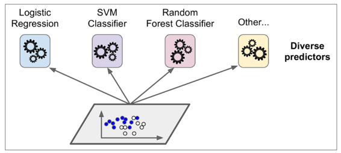

一个非常简单去创建一个更好的分类器的方法就是去整合每一个分类器的预测然后经过投票去预测分类。这种分类器就叫做硬投票分类器（详见图 7-2）。

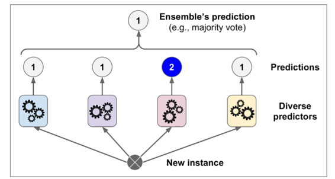

令人惊奇的是这种投票分类器得出的结果经常会比集成中最好的一个分类器结果更好。事实上，即使每一个分类器都是一个弱学习器（意味着它们也就比瞎猜好点），集成后仍然是一个强学习器（高准确率），只要有足够数量的弱学习者，他们就足够多样化。

这怎么可能？接下来的分析将帮助你解决这个疑问。假设你有一个有偏差的硬币，他有 51% 的几率为正面，49% 的几率为背面。如果你实验 1000 次，你会得到差不多 510 次正面，490 次背面，因此大多数都是正面。如果你用数学计算，你会发现在实验 1000 次后，正面概率为 51% 的人比例为 75%。你实验的次数越多，正面的比例越大（例如你试验了 10000 次，总体比例可能性就会达到 97%）。这是因为*大数定律* ：当你一直用硬币实验时，正面的比例会越来越接近 51%。图 7-3 展示了始终有偏差的硬币实验。你可以看到当实验次数上升时，正面的概率接近于 51%。最终所有 10 种实验都会收敛到 51%，它们都大于 50%。

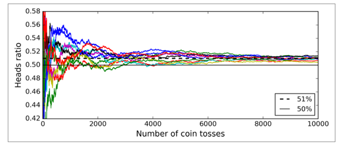

同样的，假设你创建了一个包含 1000 个分类器的集成模型，其中每个分类器的正确率只有 51%（仅比瞎猜好一点点）。如果你用投票去预测类别，你可能得到 75% 的准确率！然而，这仅仅在所有的分类器都独立运行的很好、不会发生有相关性的错误的情况下才会这样，然而每一个分类器都在同一个数据集上训练，导致其很可能会发生这样的错误。他们可能会犯同一种错误，所以也会有很多票投给了错误类别导致集成的准确率下降。

如果使每一个分类器都独立自主的分类，那么集成模型会工作的很好。去得到多样的分类器的方法之一就是用完全不同的算法，这会使它们会做出不同种类的错误，这会提高集成的正确率

接下来的代码创建和训练了在 sklearn 中的投票分类器。这个分类器由三个不同的分类器组成（训练集是第五章中的 moons 数据集）：

```python
>>> from sklearn.ensemble import RandomForestClassifier 
>>> from sklearn.ensemble import VotingClassifier 
>>> from sklearn.linear_model import LogisticRegression 
>>> from sklearn.svm import SVC
>>> log_clf = LogisticRegression() 
>>> rnd_clf = RandomForestClassifier() 
>>> svm_clf = SVC()
>>> voting_clf = VotingClassifier(estimators=[('lr', log_clf), ('rf', rnd_clf), >>> ('svc', svm_clf)],voting='hard') 
>>> voting_clf.fit(X_train, y_train)
```

让我们看一下在测试集上的准确率：

```python
>>> from sklearn.metrics import accuracy_score 
>>> for clf in (log_clf, rnd_clf, svm_clf, voting_clf): 
>>>     clf.fit(X_train, y_train) 
>>>     y_pred = clf.predict(X_test) 
>>>     print(clf.__class__.__name__, accuracy_score(y_test, y_pred)) 
LogisticRegression 0.864 
RandomForestClassifier 0.872 
SVC 0.888 
VotingClassifier 0.896 
```
你看！投票分类器比其他单独的分类器表现的都要好。

如果所有的分类器都能够预测类别的概率（例如他们有一个`predict_proba()`方法），那么你就可以让 sklearn 以最高的类概率来预测这个类，平均在所有的分类器上。这种方式叫做软投票。他经常比硬投票表现的更好，因为它给予高自信的投票更大的权重。你可以通过把`voting="hard"`设置为`voting="soft"`来保证分类器可以预测类别概率。然而这不是 SVC 类的分类器默认的选项，所以你需要把它的`probability hyperparameter`设置为`True`（这会使 SVC 使用交叉验证去预测类别概率，其降低了训练速度，但会添加`predict_proba()`方法）。如果你修改了之前的代码去使用软投票，你会发现投票分类器正确率高达 91%

## Bagging 和 Pasting 

换句话说，Bagging 和 Pasting 都允许在多个分类器间对训练集进行多次采样，但只有 Bagging

就像之前讲到的，可以通过使用不同的训练算法去得到一些不同的分类器。另一种方法就是对每一个分类器都使用相同的训练算法，但是在不同的训练集上去训练它们。有放回采样被称为装袋（*Bagging*，是 *bootstrap aggregating* 的缩写）。无放回采样称为粘贴（*pasting*）。

换句话说，Bagging 和 Pasting 都允许在多个分类器上对训练集进行多次采样，但只有 Bagging 允许对同一种分类器上对训练集进行进行多次采样。采样和训练过程如图7-4所示。

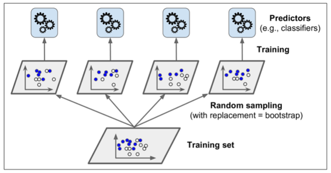

当所有的分类器被训练后，集成可以通过对所有分类器结果的简单聚合来对新的实例进行预测。聚合函数通常对分类是*统计模式*（例如硬投票分类器）或者对回归是平均。每一个单独的分类器在如果在原始训练集上都是高偏差，但是聚合降低了偏差和方差。通常情况下，集成的结果是有一个相似的偏差，但是对比与在原始训练集上的单一分类器来讲有更小的方差。

正如你在图 7-4 上所看到的，分类器可以通过不同的 CPU 核或其他的服务器一起被训练。相似的，分类器也可以一起被制作。这就是为什么 Bagging 和 Pasting 是如此流行的原因之一：它们的可扩展性很好。

### 在 sklearn 中的 Bagging 和 Pasting 

sklearn 为 Bagging 和 Pasting 提供了一个简单的API：`BaggingClassifier`类（或者对于回归可以是`BaggingRegressor`。接下来的代码训练了一个 500 个决策树分类器的集成，每一个都是在数据集上有放回采样 100 个训练实例下进行训练（这是 Bagging 的例子，如果你想尝试 Pasting，就设置`bootstrap=False`）。`n_jobs`参数告诉 sklearn 用于训练和预测所需要 CPU 核的数量。（-1 代表着 sklearn 会使用所有空闲核）：

```python
>>>from sklearn.ensemble import BaggingClassifier 
>>>from sklearn.tree import DecisionTreeClassifier
>>>bag_clf = BaggingClassifier(DecisionTreeClassifier(), n_estimators=500,        >>>max_samples=100, bootstrap=True, n_jobs=-1) 
>>>bag_clf.fit(X_train, y_train) 
>>>y_pred = bag_clf.predict(X_test)
```
如果基分类器可以预测类别概率（例如它拥有`predict_proba()`方法），那么`BaggingClassifier`会自动的运行软投票，这是决策树分类器的情况。

图 7-5 对比了单一决策树的决策边界和 Bagging 集成 500 个树的决策边界，两者都在 moons 数据集上训练。正如你所看到的，集成的分类比起单一决策树的分类产生情况更好：集成有一个可比较的偏差但是有一个较小的方差（它在训练集上的错误数目大致相同，但决策边界较不规则）。

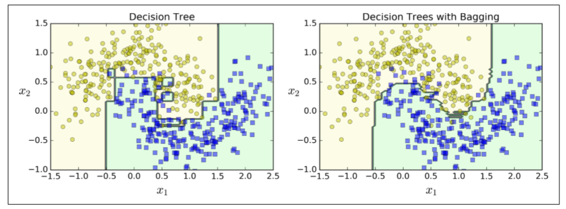

Bootstrap 在每个预测器被训练的子集中引入了更多的分集，所以 Bagging 结束时的偏差比 Pasting 更高，但这也意味着预测因子最终变得不相关，从而减少了集合的方差。总体而言，Bagging 通常会导致更好的模型，这就解释了为什么它通常是首选的。然而，如果你有空闲时间和 CPU 功率，可以使用交叉验证来评估 Bagging 和 Pasting 哪一个更好。

### Out-of-Bag 评价 

对于 Bagging 来说，一些实例可能被一些分类器重复采样，但其他的有可能不会被采样。`BaggingClassifier`默认采样。`BaggingClassifier`默认是有放回的采样`m`个实例 （`bootstrap=True`），其中`m`是训练集的大小，这意味着平均下来只有63%的训练实例被每个分类器采样，剩下的37%个没有被采样的训练实例就叫做 *Out-of-Bag* 实例。注意对于每一个的分类器它们的 37% 不是相同的。

因为在训练中分类器从开没有看到过 oob 实例，所以它可以在这些实例上进行评估，而不需要单独的验证集或交叉验证。你可以拿出每一个分类器的 oob 来评估集成本身。

在 sklearn 中，你可以在训练后需要创建一个`BaggingClassifier`来自动评估时设置`oob_score=True`来自动评估。接下来的代码展示了这个操作。评估结果通过变量`oob_score_`来显示：

```python
>>> bag_clf = BaggingClassifier(DecisionTreeClassifier(), n_estimators=500,bootstrap=True, n_jobs=-1, oob_score=True)
>>> bag_clf.fit(X_train, y_train) 
>>> bag_clf.oob_score_ 
0.93066666666666664 
```

根据这个 obb 评估，`BaggingClassifier`可以再测试集上达到93.1%的准确率，让我们修改一下：

```python
>>> from sklearn.metrics import accuracy_score 
>>>y_pred = bag_clf.predict(X_test) 
>>> accuracy_score(y_test, y_pred) 
0.93600000000000005 
```

我们在测试集上得到了 93.6% 的准确率，足够接近了！

对于每个训练实例 oob 决策函数也可通过`oob_decision_function_`变量来展示。在这种情况下（当基决策器有`predict_proba()`时）决策函数会对每个训练实例返回类别概率。例如，oob 评估预测第二个训练实例有 60.6% 的概率属于正类（39.4% 属于负类）：

```python
>>> bag_clf.oob_decision_function_ 
array([[ 0.,  1.], [ 0.60588235,  0.39411765],[ 1., 0. ], 
...  [ 1. ,  0. ],[ 0.,  1.],[ 0.48958333,  0.51041667]]) 
```

## 随机贴片与随机子空间

`BaggingClassifier`也支持采样特征。它被两个超参数`max_features`和`bootstrap_features`控制。他们的工作方式和`max_samples`和`bootstrap`一样，但这是对于特征采样而不是实例采样。因此，每一个分类器都会被在随机的输入特征内进行训练。

当你在处理高维度输入下（例如图片）此方法尤其有效。对训练实例和特征的采样被叫做随机贴片。保留了所有的训练实例（例如`bootstrap=False`和`max_samples=1.0`），但是对特征采样（`bootstrap_features=True`并且/或者`max_features`小于 1.0）叫做随机子空间。

采样特征导致更多的预测多样性，用高偏差换低方差。

## 随机森林

正如我们所讨论的，随机森林是决策树的一种集成，通常是通过 bagging 方法（有时是 pasting 方法）进行训练，通常用`max_samples`设置为训练集的大小。与建立一个`BaggingClassifier`然后把它放入 *DecisionTreeClassifier* 相反，你可以使用更方便的也是对决策树优化够的`RandomForestClassifier`（对于回归是`RandomForestRegressor`）。接下来的代码训练了带有 500 个树（每个被限制为 16 叶子结点）的决策森林，使用所有空闲的 CPU 核：

```python
>>>from sklearn.ensemble import RandomForestClassifier
>>>rnd_clf = RandomForestClassifier(n_estimators=500, max_leaf_nodes=16, n_jobs=-1) 
>>>rnd_clf.fit(X_train, y_train)
>>>y_pred_rf = rnd_clf.predict(X_test)
```

除了一些例外，`RandomForestClassifier`使用`DecisionTreeClassifier`的所有超参数（决定数怎么生长），把`BaggingClassifier`的超参数加起来来控制集成本身。

随机森林算法在树生长时引入了额外的随机；与在节点分裂时需要找到最好分裂特征相反（详见第六章），它在一个随机的特征集中找最好的特征。它导致了树的差异性，并且再一次用高偏差换低方差，总的来说是一个更好的模型。以下是`BaggingClassifier`大致相当于之前的`randomforestclassifier`：

```python
>>>bag_clf = BaggingClassifier(DecisionTreeClassifier(splitter="random", max_leaf_nodes=16),n_estimators=500, max_samples=1.0, bootstrap=True, n_jobs=-1)
```

### 极端随机树

当你在随机森林上生长树时，在每个结点分裂时只考虑随机特征集上的特征（正如之前讨论过的一样）。相比于找到更好的特征我们可以通过使用对特征使用随机阈值使树更加随机（像规则决策树一样）。

这种极端随机的树被简称为 *Extremely Randomized Trees*（极端随机树），或者更简单的称为 *Extra-Tree*。再一次用高偏差换低方差。它还使得 *Extra-Tree* 比规则的随机森林更快地训练，因为在每个节点上找到每个特征的最佳阈值是生长树最耗时的任务之一。

你可以使用 sklearn 的`ExtraTreesClassifier`来创建一个 *Extra-Tree* 分类器。他的 API 跟`RandomForestClassifier`是相同的，相似的， *ExtraTreesRegressor* 跟`RandomForestRegressor`也是相同的 API。

我们很难去分辨`ExtraTreesClassifier`和`RandomForestClassifier`到底哪个更好。通常情况下是通过交叉验证来比较它们（使用网格搜索调整超参数）。

### 特征重要度

最后，如果你观察一个单一决策树，重要的特征会出现在更靠近根部的位置，而不重要的特征会经常出现在靠近叶子的位置。因此我们可以通过计算一个特征在森林的全部树中出现的平均深度来预测特征的重要性。sklearn 在训练后会自动计算每个特征的重要度。你可以通过`feature_importances_`变量来查看结果。例如如下代码在 iris 数据集（第四章介绍）上训练了一个`RandomForestClassifier`模型，然后输出了每个特征的重要性。看来，最重要的特征是花瓣长度（44%）和宽度（42%），而萼片长度和宽度相对比较是不重要的（分别为 11% 和 2%）：

```python
>>> from sklearn.datasets import load_iris 
>>> iris = load_iris() 
>>> rnd_clf = RandomForestClassifier(n_estimators=500, n_jobs=-1) 
>>> rnd_clf.fit(iris["data"], iris["target"]) 
>>> for name, score in zip(iris["feature_names"], rnd_clf.feature_importances_): 
>>>     print(name, score) 
sepal length (cm) 0.112492250999
sepal width (cm) 0.0231192882825 
petal length (cm) 0.441030464364 
petal width (cm) 0.423357996355 
```

相似的，如果你在 MNIST 数据及上训练随机森林分类器（在第三章上介绍），然后画出每个像素的重要性，你可以得到图 7-6 的图片。

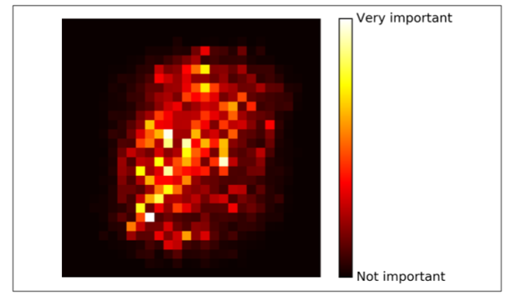

随机森林可以非常方便快速得了解哪些特征实际上是重要的，特别是你需要进行特征选择的时候。

## 提升

提升（Boosting，最初称为*假设增强*）指的是可以将几个弱学习者组合成强学习者的集成方法。对于大多数的提升方法的思想就是按顺序去训练分类器，每一个都要尝试修正前面的分类。现如今已经有很多的提升方法了，但最著名的就是 *Adaboost*（适应性提升，是 *Adaptive Boosting* 的简称） 和 *Gradient Boosting*（梯度提升）。让我们先从 *Adaboost* 说起。

### Adaboost

使一个新的分类器去修正之前分类结果的方法就是对之前分类结果不对的训练实例多加关注。这导致新的预测因子越来越多地聚焦于这种情况。这是 *Adaboost* 使用的技术。

举个例子，去构建一个 Adaboost 分类器，第一个基分类器（例如一个决策树）被训练然后在训练集上做预测，在误分类训练实例上的权重就增加了。第二个分类机使用更新过的权重然后再一次训练，权重更新，以此类推（详见图 7-7）


图 7-8 显示连续五次预测的 moons 数据集的决策边界（在本例中，每一个分类器都是高度正则化带有 RBF 核的 SVM）。第一个分类器误分类了很多实例，所以它们的权重被提升了。第二个分类器因此对这些误分类的实例分类效果更好，以此类推。右边的图代表了除了学习率减半外（误分类实例权重每次迭代上升一半）相同的预测序列。你可以看出，序列学习技术与梯度下降很相似，除了调整单个预测因子的参数以最小化代价函数之外，AdaBoost 增加了集合的预测器，逐渐使其更好。

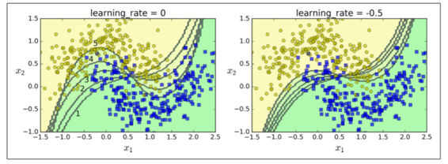

一旦所有的分类器都被训练后，除了分类器根据整个训练集上的准确率被赋予的权重外，集成预测就非常像Bagging和Pasting了。

序列学习技术的一个重要的缺点就是：它不能被并行化（只能按步骤），因为每个分类器只能在之前的分类器已经被训练和评价后再进行训练。因此，它不像Bagging和Pasting一样。

让我们详细看一下 Adaboost 算法。每一个实例的权重`wi`初始都被设为`1/m`第一个分类器被训练，然后他的权重误差率`r1`在训练集上算出，详见公式 7-1。

公式7-1：第`j`个分类器的权重误差率

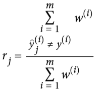

其中 $\widetilde{y_{j}}^{i}$ 是第`j`个分类器对于第`i`实例的预测。

分类器的权重 $α_{j}$ 随后用公式 7-2 计算出来。其中`η`是超参数学习率（默认为 1）。分类器准确率越高，它的权重就越高。如果它只是瞎猜，那么它的权重会趋近于 0。然而，如果它总是出错（比瞎猜的几率都低），它的权重会使负数。

公式 7-2：分类器权重

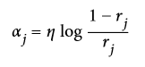

接下来实例的权重会按照公式 7-3 更新：误分类的实例权重会被提升。

公式7-3 权重更新规则

对于`i=1, 2, ..., m`

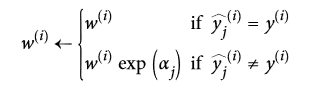

随后所有实例的权重都被归一化（例如被 $\sum_{i=1}^{m}w^{i}$ 整除）

最后，一个新的分类器通过更新过的权重训练，整个过程被重复（新的分类器权重被计算，实例的权重被更新，随后另一个分类器被训练，以此类推）。当规定的分类器数量达到或者最好的分类器被找到后算法就会停止。

为了进行预测，Adaboost 通过分类器权重 $α_{j}$ 简单的计算了所有的分类器和权重。预测类别会是权重投票中主要的类别。（详见公式 7-4）

公式7-4： Adaboost 分类器

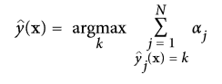

其中`N`是分类器的数量。

sklearn 通常使用 Adaboost 的多分类版本 *SAMME*（这就代表了 *分段加建模使用多类指数损失函数*）。如果只有两类别，那么 *SAMME* 是与 Adaboost 相同的。如果分类器可以预测类别概率（例如如果它们有`predict_proba()`），如果 sklearn 可以使用 *SAMME* 叫做`SAMME.R`的变量（R 代表“REAL”），这种依赖于类别概率的通常比依赖于分类器的更好。

接下来的代码训练了使用 sklearn 的`AdaBoostClassifier`基于 200 个决策树桩 Adaboost 分类器（正如你说期待的，对于回归也有`AdaBoostRegressor`）。一个决策树桩是`max_depth=1`的决策树-换句话说，是一个单一的决策节点加上两个叶子结点。这就是`AdaBoostClassifier`的默认基分类器：

```python
>>>from sklearn.ensemble import AdaBoostClassifier
>>>ada_clf = AdaBoostClassifier(DecisionTreeClassifier(max_depth=1), n_estimators=200,algorithm="SAMME.R", learning_rate=0.5) 
>>>ada_clf.fit(X_train, y_train)
```

如果你的 Adaboost 集成过拟合了训练集，你可以尝试减少基分类器的数量或者对基分类器使用更强的正则化。

### 梯度提升

另一个非常著名的提升算法是梯度提升。与 Adaboost 一样，梯度提升也是通过向集成中逐步增加分类器运行的，每一个分类器都修正之前的分类结果。然而，它并不像 Adaboost 那样每一次迭代都更改实例的权重，这个方法是去使用新的分类器去拟合前面分类器预测的*残差* 。

让我们通过一个使用决策树当做基分类器的简单的回归例子（回归当然也可以使用梯度提升）。这被叫做梯度提升回归树（GBRT，*Gradient Tree Boosting* 或者 *Gradient Boosted Regression Trees*）。首先我们用`DecisionTreeRegressor`去拟合训练集（例如一个有噪二次训练集）：

```python
>>>from sklearn.tree import DecisionTreeRegressor 
>>>tree_reg1 = DecisionTreeRegressor(max_depth=2) 
>>>tree_reg1.fit(X, y) 
```

现在在第一个分类器的残差上训练第二个分类器：

```python
>>>y2 = y - tree_reg1.predict(X) 
>>>tree_reg2 = DecisionTreeRegressor(max_depth=2) 
>>>tree_reg2.fit(X, y2) 
```

随后在第二个分类器的残差上训练第三个分类器：

```python
>>>y3 = y2 - tree_reg1.predict(X) 
>>>tree_reg3 = DecisionTreeRegressor(max_depth=2) 
>>>tree_reg3.fit(X, y3) 
```

现在我们有了一个包含三个回归器的集成。它可以通过集成所有树的预测来在一个新的实例上进行预测。

```python
>>>y_pred = sum(tree.predict(X_new) for tree in (tree_reg1, tree_reg2, tree_reg3)) 
```

图7-9在左栏展示了这三个树的预测，在右栏展示了集成的预测。在第一行，集成只有一个树，所以它与第一个树的预测相似。在第二行，一个新的树在第一个树的残差上进行训练。在右边栏可以看出集成的预测等于前两个树预测的和。相同的，在第三行另一个树在第二个数的残差上训练。你可以看到集成的预测会变的更好。

我们可以使用 sklean 中的`GradientBoostingRegressor`来训练 GBRT 集成。与`RandomForestClassifier`相似，它也有超参数去控制决策树的生长（例如`max_depth`，`min_samples_leaf`等等），也有超参数去控制集成训练，例如基分类器的数量（`n_estimators`）。接下来的代码创建了与之前相同的集成：

```python
>>>from sklearn.ensemble import GradientBoostingRegressor
>>>gbrt = GradientBoostingRegressor(max_depth=2, n_estimators=3, learning_rate=1.0) 
>>>gbrt.fit(X, y)
```

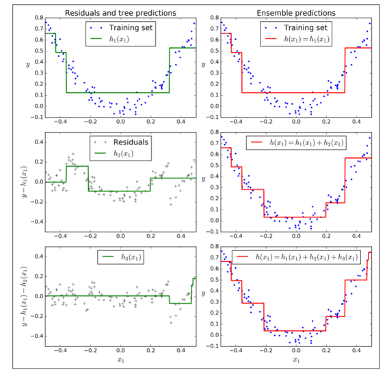

超参数`learning_rate` 确立了每个树的贡献。如果你把它设置为一个很小的树，例如 0.1，在集成中就需要更多的树去拟合训练集，但预测通常会更好。这个正则化技术叫做 *shrinkage*。图 7-10 展示了两个在低学习率上训练的 GBRT 集成：其中左面是一个没有足够树去拟合训练集的树，右面是有过多的树过拟合训练集的树。

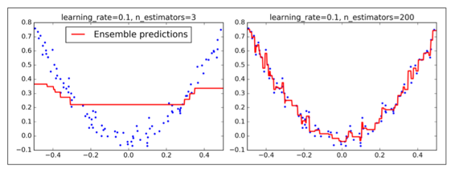

为了找到树的最优数量，你可以使用早停技术（第四章讨论）。最简单使用这个技术的方法就是使用`staged_predict()`：它在训练的每个阶段（用一棵树，两棵树等）返回一个迭代器。加下来的代码用 120 个树训练了一个 GBRT 集成，然后在训练的每个阶段验证错误以找到树的最佳数量，最后使用 GBRT 树的最优数量训练另一个集成：

```python
>>>import numpy as np 
>>>from sklearn.model_selection 
>>>import train_test_split from sklearn.metrics 
>>>import mean_squared_error
>>>X_train, X_val, y_train, y_val = train_test_split(X, y)
>>>gbrt = GradientBoostingRegressor(max_depth=2, n_estimators=120) gbrt.fit(X_train, y_train)
>>>errors = [mean_squared_error(y_val, y_pred)         
     for y_pred in gbrt.staged_predict(X_val)] 
>>>bst_n_estimators = np.argmin(errors)
>>>gbrt_best = GradientBoostingRegressor(max_depth=2,n_estimators=bst_n_estimators) >>>gbrt_best.fit(X_train, y_train) 
```

验证错误在图 7-11 的左面展示，最优模型预测被展示在右面。

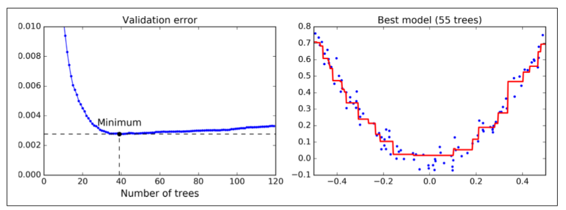

你也可以早早的停止训练来实现早停（与先在一大堆树中训练，然后再回头去找最优数目相反）。你可以通过设置`warm_start=True`来实现 ，这使得当`fit()`方法被调用时 sklearn 保留现有树，并允许增量训练。接下来的代码在当一行中的五次迭代验证错误没有改善时会停止训练：

```python
>>>gbrt = GradientBoostingRegressor(max_depth=2, warm_start=True)
min_val_error = float("inf") 
error_going_up = 0 
for n_estimators in range(1, 120):    
    gbrt.n_estimators = n_estimators    
    gbrt.fit(X_train, y_train)    
    y_pred = gbrt.predict(X_val)    
    val_error = mean_squared_error(y_val, y_pred)    
    if val_error < min_val_error:        
        min_val_error = val_error        
        error_going_up = 0    
    else:        
        error_going_up += 1        
        if error_going_up == 5:            
            break  # early stopping 
```

`GradientBoostingRegressor`也支持指定用于训练每棵树的训练实例比例的超参数`subsample`。例如如果`subsample=0.25`，那么每个树都会在 25% 随机选择的训练实例上训练。你现在也能猜出来，这也是个高偏差换低方差的作用。它同样也加速了训练。这个技术叫做*随机梯度提升*。

也可能对其他损失函数使用梯度提升。这是由损失超参数控制（见 sklearn 文档）。

## Stacking

本章讨论的最后一个集成方法叫做 *Stacking*（*stacked generalization* 的缩写）。这个算法基于一个简单的想法：不使用琐碎的函数（如硬投票）来聚合集合中所有分类器的预测，我们为什么不训练一个模型来执行这个聚合？图 7-12 展示了这样一个在新的回归实例上预测的集成。底部三个分类器每一个都有不同的值（3.1，2.7 和 2.9），然后最后一个分类器（叫做 *blender* 或者 *meta learner* ）把这三个分类器的结果当做输入然后做出最终决策（3.0）。

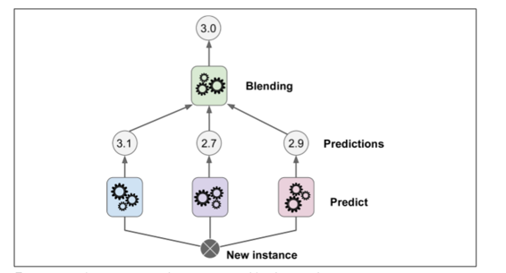

为了训练这个 *blender* ，一个通用的方法是采用保持集。让我们看看它怎么工作。首先，训练集被分为两个子集，第一个子集被用作训练第一层（详见图 7-13）.


接下来，第一层的分类器被用来预测第二个子集（保持集）（详见 7-14）。这确保了预测结果很“干净”，因为这些分类器在训练的时候没有使用过这些事例。现在对在保持集中的每一个实例都有三个预测值。我们现在可以使用这些预测结果作为输入特征来创建一个新的训练集（这使得这个训练集是三维的），并且保持目标数值不变。随后 *blender* 在这个新的训练集上训练，因此，它学会了预测第一层预测的目标值。


显然我们可以用这种方法训练不同的 *blender* （例如一个线性回归，另一个是随机森林等等）：我们得到了一层 *blender* 。诀窍是将训练集分成三个子集：第一个子集用来训练第一层，第二个子集用来创建训练第二层的训练集（使用第一层分类器的预测值），第三个子集被用来创建训练第三层的训练集（使用第二层分类器的预测值）。以上步骤做完了，我们可以通过逐个遍历每个层来预测一个新的实例。详见图 7-15.


然而不幸的是，sklearn 并不直接支持 stacking ，但是你自己组建是很容易的（看接下来的练习）。或者你也可以使用开源的项目例如 *brew* （网址为 <https://github.com/viisar/brew>）

## 练习

1.  如果你在相同训练集上训练 5 个不同的模型，它们都有 95% 的准确率，那么你是否可以通过组合这个模型来得到更好的结果？如果可以那怎么做呢？如果不可以请给出理由。
2.  软投票和硬投票分类器之间有什么区别？
3.  是否有可能通过分配多个服务器来加速 bagging 集成系统的训练？pasting 集成，boosting 集成，随机森林，或 stacking 集成怎么样？
4.  out-of-bag 评价的好处是什么？
5.  是什么使 Extra-Tree 比规则随机森林更随机呢？这个额外的随机有什么帮助呢？那这个 Extra-Tree 比规则随机森林谁更快呢？
6.  如果你的 Adaboost 模型欠拟合，那么你需要怎么调整超参数？
7.  如果你的梯度提升过拟合，那么你应该调高还是调低学习率呢？
8.  导入 MNIST 数据（第三章中介绍），把它切分进一个训练集，一个验证集，和一个测试集（例如 40000 个实例进行训练，10000 个进行验证，10000 个进行测试）。然后训练多个分类器，例如一个随机森林分类器，一个 Extra-Tree 分类器和一个 SVM。接下来，尝试将它们组合成集成，使用软或硬投票分类器来胜过验证集上的所有集合。一旦找到了，就在测试集上实验。与单个分类器相比，它的性能有多好？
9.  从练习 8 中运行个体分类器来对验证集进行预测，并创建一个新的训练集并生成预测：每个训练实例是一个向量，包含来自所有分类器的图像的预测集，目标是图像类别。祝贺你，你刚刚训练了一个 *blender* ，和分类器一起组成了一个叠加组合！现在让我们来评估测试集上的集合。对于测试集中的每个图像，用所有分类器进行预测，然后将预测馈送到 *blender* 以获得集合的预测。它与你早期训练过的投票分类器相比如何？

练习的答案都在附录 A 上。
