# 附录 C、SVM 对偶问题

为了理解对偶性，你首先得理解拉格朗日乘子法。它基本思想是将一个有约束优化问题转化为一个无约束优化问题，其方法是将约束条件移动到目标函数中去。让我们看一个简单的例子，例如要找到合适的  和  使得函数 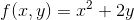 最小化，且其约束条件是一个等式约束：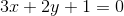。使用拉格朗日乘子法，我们首先定义一个函数，称为**拉格朗日函数**：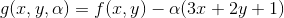。每个约束条件（在这个例子中只有一个）与新的变量（称为拉格朗日乘数）相乘，作为原目标函数的减数。

Joseph-Louis Lagrange 大牛证明了如果 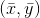 是原约束优化问题的解，那么一定存在一个 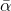，使得 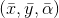 是拉格朗日函数的驻点（驻点指的是，在该点处，该函数所有的偏导数均为 0）。换句话说，我们可以计算拉格朗日函数 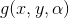 关于 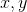 以及  的偏导数；然后我们可以找到那些偏导数均为 0 的驻点；最后原约束优化问题的解（如果存在）一定在这些驻点里面。

在上述例子里，偏导数为

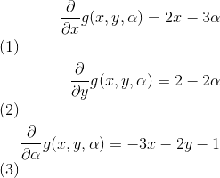  

当这些偏导数均为 0 时，即 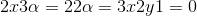，即可得 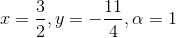。这是唯一一个驻点，那它一定是原约束优化问题的解。然而，上述方法仅应用于等式约束，幸运的是，在某些正则性条件下，这种方法也可被一般化应用于不等式约束条件（例如不等式约束，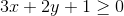）。如下公式 C-1 ，给了 SVM 硬间隔问题时的一般化拉格朗日函数。在该公式中，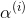 是 KKT 乘子，它必须大于或等于 0。

> 译者注
> 
>  是 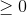 抑或 ，取决于拉格朗日函数的写法，以及原目标函数函数最大化抑或最小化。

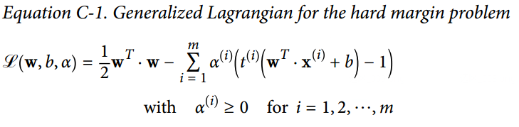

就像拉格朗日乘子法，我们可以计算上述式子的偏导数、定位驻点。如果该原问题存在一个解，那它一定在驻点 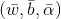 之中，且遵循 KKT 条件：

- 遵循原问题的约束：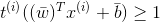, 对于 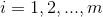
- 遵循现问题里的约束，即 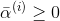
-  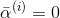 或者第`i`个约束条件是积极约束，意味着该等式成立：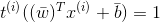。这个条件叫做 互补松弛条件。它暗示了  和第`i`个样本位于 SVM 间隔的边界上（该样本是支持向量）。

注意 KKT 条件是确定驻点是否为原问题解的必要条件。在某些条件下，KKT 条件也是充分条件。幸运的是，SVM 优化问题碰巧满足这些条件，所以任何满足 KKT 条件的驻点保证是原问题的解。

我们可以计算上述一般化拉格朗日函数关于`w`和`b`的偏导数，如公式 C-2。

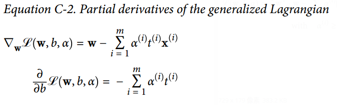

令上述偏导数为 0，可得到公式 C-3。

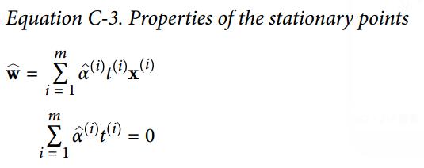

如果我们把上述式子代入到一般化拉格朗日函数（公式 C-1）中，某些项会消失，从而得到公式 C-4，并称之为原问题的对偶形式。

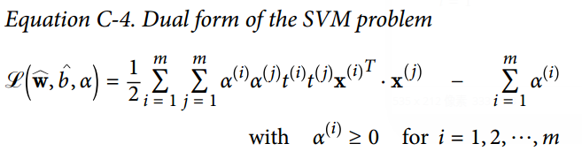

现在该对偶形式的目标是找到合适的向量 ，使得该函数 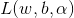 最小化，且 。现在这个有约束优化问题正是我们苦苦追寻的对偶问题。

一旦你找到了最优的 ，你可以利用公式 C-3 第一行计算 。为了计算 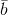，你可以使用支持向量的已知条件 ，当第 k 个样本是支持向量时（即它对应的 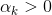），此时使用它计算 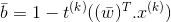。对了，我们更喜欢利用所有支持向量计算一个平均值，以获得更稳定和更准确的结果，如公式 C-5。

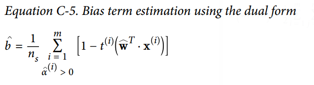
