# 附录 D、自动微分

这个附录解释了 TensorFlow 的自动微分功能是如何工作的，以及它与其他解决方案的对比。

假定你定义了函数 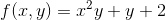，需要得到它的偏导数 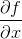 和 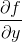，以用于梯度下降或者其他优化算法。你的可选方案有手动微分法，符号微分法，数值微分法，前向自动微分，和反向自动微分。TensorFlow 实现的反向自动微分法。我们来看看每种方案。

## 手动微分法

第一个方法是拿起一直笔和一张纸，使用你的代数知识去手动的求偏导数。对于已定义的函数，求它的偏导并不太困难。你需要使用如下 5 条规则：

- 常数的导数为 0。
- 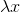 的导数为 ， 为常数。
- 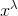 的导数是 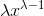
- 函数的和的导数，等于函数的导数的和
-  乘以函数，再求导，等于  乘以函数的导数

从上述这些规则，可得到公式 D-1。

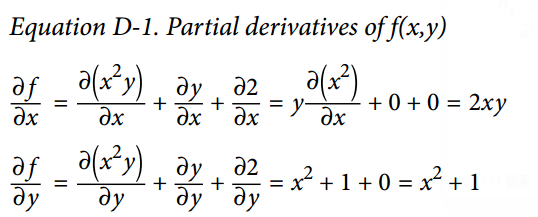

这个种方法应用于更复杂函数时将变得非常罗嗦，并且有可能出错。好消息是，像刚才我们做的求数学式子的偏导数可以被自动化，通过一个称为符号微分的过程。

## 符号微分

图 D-1 展示了符号微分是如何运行在相当简单的函数上的，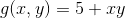。该函数的计算图如图的左边所示。通过符号微分，我们可得到图的右部分，它代表了 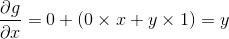，相似地也可得到关于`y`的导数。

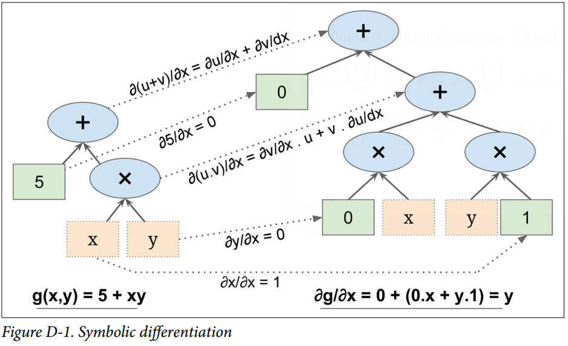

概算法先获得叶子节点的偏导数。常数 5 返回常数 0，因为常数的导数总是 0。变量`x`返回常数 1，变量`y`返回常数 0，因为 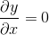（如果我们找关于`y`的偏导数，那它将反过来）。

现在我们移动到计算图的相乘节点处，代数告诉我们，`u`和`v`相乘后的导数为 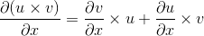。因此我们可以构造有图中大的部分，代表`0 × x + y × 1`。

最后我们往上走到计算图的相加节点处，正如 5 条规则里提到的，和的导数等于导数的和。所以我们只需要创建一个相加节点，连接我们已经计算出来的部分。我们可以得到正确的偏导数，即：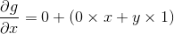。

然而，这个过程可简化。对该图应用一些微不足道的剪枝步骤，可以去掉所有不必要的操作，然后我们可以得到一个小得多的只有一个节点的偏导计算图：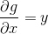。

在这个例子里，简化操作是相当简单的，但对更复杂的函数来说，符号微分会产生一个巨大的计算图，该图可能很难去简化，以导致次优的性能。更重要的是，符号微分不能处理由任意代码定义的函数，例如，如下已在第 9 章讨论过的函数：

```python
def my_func(a, b):
    z = 0
    for i in range(100):
        z = a * np.cos(z + i) + z * np.sin(b - i)
    return z
```

## 数值微分

从数值上说，最简单的方案是去计算导数的近似值。回忆`h(x)`在 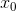 的导数 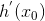，是该函数在该点处的斜率，或者更准确如公式 D-2 所示。

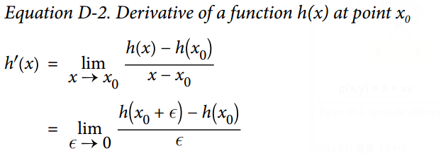

因此如果我们想要计算 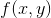 关于`x`，在 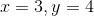 处的导数，我们可以简单计算 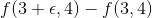 的值，将这个结果除以 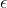，且  去很小的值。这个过程正是如下的代码所要干的。

```python
def f(x, y):
    return x**2*y + y + 2
  
def derivative(f, x, y, x_eps, y_eps):
    return (f(x + x_eps, y + y_eps) - f(x, y)) / (x_eps + y_eps)
  
df_dx = derivative(f, 3, 4, 0.00001, 0)
df_dy = derivative(f, 3, 4, 0, 0.00001)
```

不幸的是，偏导的结果并不准确（并且可能在求解复杂函数时更糟糕）。上述正确答案分别是 24 和 10 ，但我们得到的是：

```python
>>> print(df_dx)
24.000039999805264
>>> print(df_dy)
10.000000000331966
```

注意到为了计算两个偏导数， 我们不得不调用`f()`至少三次（在上述代码里我们调用了四次，但可以优化）。如果存在 1000 个参数，我们将会调用`f()`至少 1001 次。当处理大的神经网络时，这样的操作很没有效率。

然而，数值微分实现起来如此简单，以至于它是检查其他方法正确性的优秀工具。例如，如果它的结果与您手动计算的导数不同，那么你的导数可能包含错误。

## 前向自动微分

前向自动微分既不是数值微分，也不是符号微分，但在某些方面，它是他们的爱情结晶。它依赖对偶数。对偶数是奇怪但迷人的，是 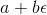 形式的数，这里`a`和`b`是实数， 是无穷小的数，满足 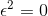，但 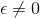。你可以认为对偶数 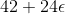 类似于有着无穷个 0 的 42.0000⋯000024（但当然这是简化后的，仅仅给你对偶数什么的想法）。一个对偶数在内存中表示为一个浮点数对，例如， 表示为`(42.0, 24.0)`。

对偶数可相加、相乘、等等操作，正如公式 D-3 所示。

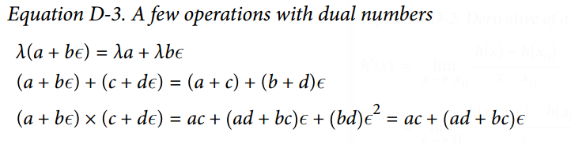

最重要的，可证明`h(a + bϵ) = h(a) + b × h'(a)ϵ`，所以计算一次`h(a + ϵ)`就得到了两个值`h(a)`和`h'(a)`。图 D-2 展示了前向自动微分如何计算  关于`x`，在  处的导数。我们所要做的一切只是计算 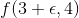；它将输出一个对偶数，其第一部分等于 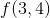，第二部分等于 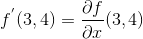。

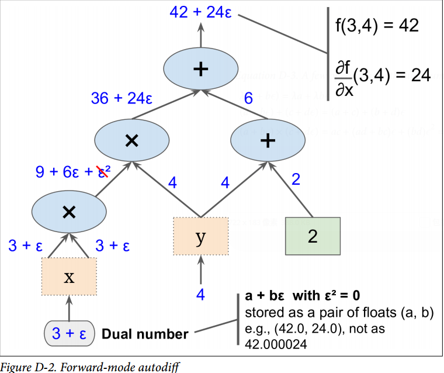

为了计算 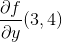 我们不得不再遍历一遍计算图，但这次前馈的值为 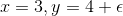。

所以前向自动微分比数值微分准确得多，但它遭受同样的缺陷：如果有 1000 个参数，那为了计算所有的偏导数，得历经计算图 1000 次。这正是反向自动微分耀眼的地方：计算所有的偏导数，它只需要遍历计算图 2 次。

## 反向自动微分

反向自动微分是 TensorFlow 采取的方案。它首先前馈遍历计算图（即，从输入到输出），计算出每个节点的值。然后进行第二次遍历，这次是反向遍历（即，从输出到输入），计算出所有的偏导数。图 D-3 展示了第二次遍历的过程。在第一次遍历过程中，所有节点值已被计算，输入是 。你可以在每个节点底部右方看到这些值（例如，）。节点已被标号，从 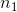 到 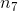。输出节点是 。

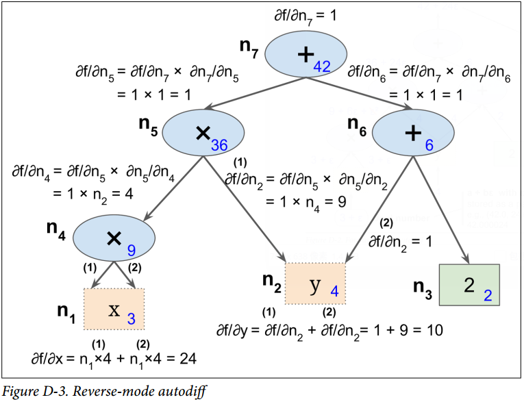

这个计算关于每个连续节点的偏导数的思想逐渐地从上到下遍历图，直到到达变量节点。为实现这个，反向自动微分强烈依赖于链式法则，如公式 D-4 所示。

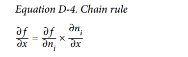

由于  是输出节点，即 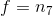，所以 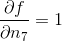。

接着到了图的 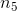 节点：当  变化时，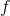 会变化多少？答案是 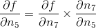。我们已经知道 ，因此我们只需要知道 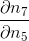 就行。因为  是 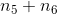 的和，因此可得到 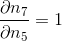，因此 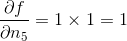。

现在前进到 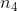：当  变化时， 会变化多少？答案是 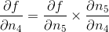。由于 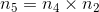，我们可得到 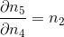，所以 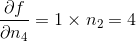。

这个遍历过程一直持续，此时我们达到图的底部。这时我们已经得到了所有偏导数在点  处的值。在这个例子里，我们得到 。听起来很美妙！

反向自动微分是非常强大且准确的技术，尤其是当有很多输入参数和极少输出时，因为它只要求一次前馈传递加上一次反向传递，就可计算所有输出关于所有输入的偏导数。最重要的是，它可以处理任意代码定义的函数。它也可以处理那些不完全可微的函数，只要  你要求他计算的偏导数在该点处是可微的。

如果你在 TensorFlow 中实现了新算子，你想使它与现有的自动微分相兼容，那你需要提供函数，该函数用于构建一个子图，来计算关于新算子输入的偏导数。例如，假设你实现了一个计算其输入的平方的函数，平方算子 ，在这个例子中你需要提供相应的导函数 。注意这个导函数不计算一个数值结果，而是用于构建子图，该子图后续将计算偏导结果。这是非常有用的，因为这意味着你可以计算梯度的梯度（为了计算二阶导数，或者甚至更高阶的导数）。
